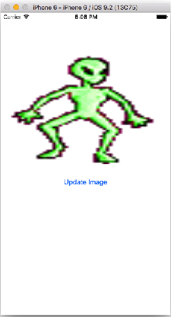
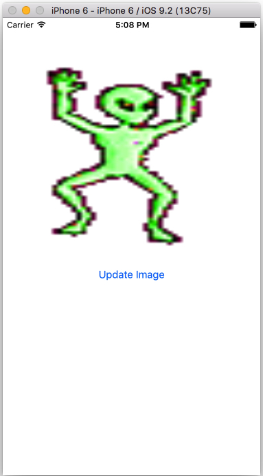
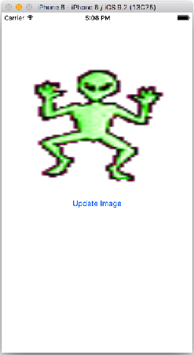
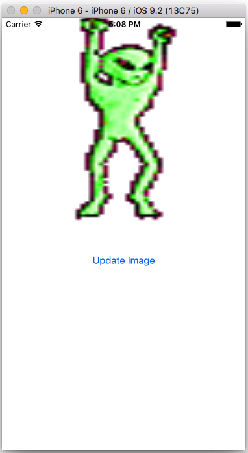
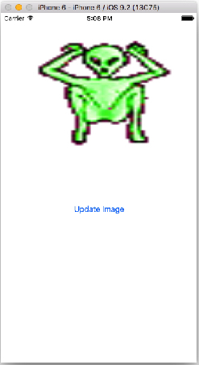

# 02 장

####1. UIImageView를 이용한 간단한 애니메이션

    


```Swift
//  ViewController.swift
//  Animations

import UIKit

class ViewController: UIViewController {
    var counter = 1
    
    @IBOutlet var alienImage: UIImageView!

    @IBAction func updateImage(sender: AnyObject) {
        if counter == 5 {
            counter = 1
        } else {
            counter++  
        }
        alienImage.image = UIImage(named: "frame\(counter).png")
    }
    
    override func viewDidLoad() {
        super.viewDidLoad()
        // Do any additional setup after loading the view, typically from a nib.
    }
}
```


####2. NSTimer를 이용한 간단한 애니메이션

