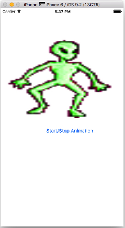
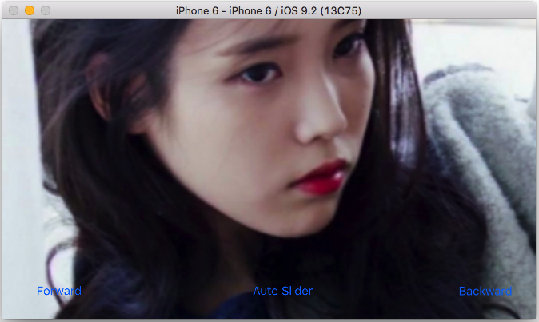

# 02 장

####1. `UIImageView`를 이용한 간단한 애니메이션

    


```Swift
//  ViewController.swift
//  Animations

import UIKit

class ViewController: UIViewController {
    var counter = 1
    
    @IBOutlet var alienImage: UIImageView!

    @IBAction func updateImage(sender: AnyObject) {
        if counter == 5 {
            counter = 1
        } else {
            counter++  
        }
        alienImage.image = UIImage(named: "frame\(counter).png")
    }
    
    override func viewDidLoad() {
        super.viewDidLoad()
        // Do any additional setup after loading the view, typically from a nib.
    }
}
```


####2. `NSTimer`를 이용한 간단한 애니메이션

 

```Swift
//  ViewController.swift
//  Animations with Timer

import UIKit

class ViewController: UIViewController {
    
    var counter = 1
    var timer = NSTimer()
    var isAnimating = true
    
    @IBOutlet var alienImage: UIImageView!

    @IBAction func updateImage(sender: AnyObject) {
        
        //  에니메이션 play 중에 버튼을 누르면 Timer를 중지함
        if isAnimating == true {
            
            timer.invalidate()
            
            isAnimating = false
            
        } else {
            
            // 에니메이션 no play이면 Timer를 호출함
            timer = NSTimer.scheduledTimerWithTimeInterval(0.3, target: self, 
                    selector: Selector("doAnimation"), userInfo: nil, repeats: true)
            
            isAnimating = true
        } 
    }
    
    override func viewDidLoad() {
        super.viewDidLoad()
        
        timer = NSTimer.scheduledTimerWithTimeInterval(0.3, target: self, selector: Selector("doAnimation"), userInfo: nil, repeats: true)
        
    }
    
    func doAnimation() {
        if counter == 5 {
            counter = 1
        } else {
            counter++
        }
        
        alienImage.image = UIImage(named: "frame\(counter).png")
    }
    
//    override func viewDidLayoutSubviews() {
//        
//        alienImage.frame = CGRectMake(100, 20, 0, 0)
//        
//    }
//    
//    override func viewDidAppear(animated: Bool) {
//        
//        UIView.animateWithDuration(1, animations: { () -> Void in
//            self.alienImage.frame = CGRectMake(100, 20, 100, 200)
//            
//        })
//    }
    
}
```


**[코딩 문제 07] `UIImageView`를 이용한 슬라이드 쇼 앱 제작**

* *코딩 조건 1)*
image를 5개를 배열에 넣고, 디바이스가 landscape 형식으로 보여 지게 하라.
* *코딩 조건 2)*
Forward/Backwrad 버튼을 한번 터치할때 마다 이미지가 한장씩 순방향/역방향으로 각각 이동하며, 마지막 이미지와 첫번째 이미지를 만나면 circular 방식(1->2->3->4->5->4->3->2->1)으로 보여진다.
* *코딩 조건 3)*
이미지의 첫번째와 마지막에서 더이상의 이미지를 보여줄 수 없을때는 각각 Forward/ Backward 버튼은 각각 hidden 된다. 

*1) 첫번째 이미지*


*2) 두번째 이미지*


*3) 세번째 이미지*


**[코딩 문제 08] [코딩 문제 07]을 `NSTimer`를 이용하여 슬라리드 쇼가 될 수 있도록 Play/Stop 버튼(AutoSlider)을 추가하시오.**

