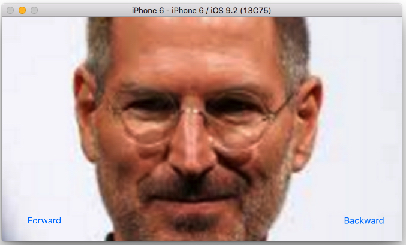
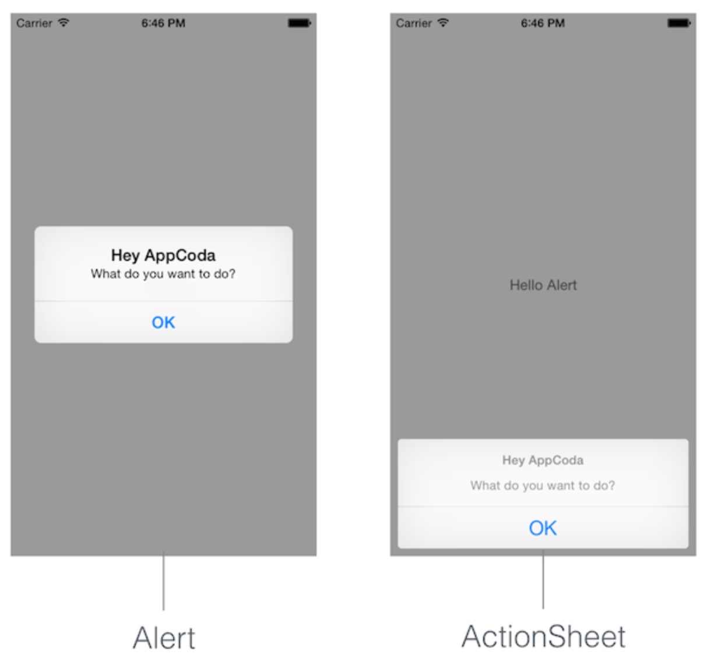
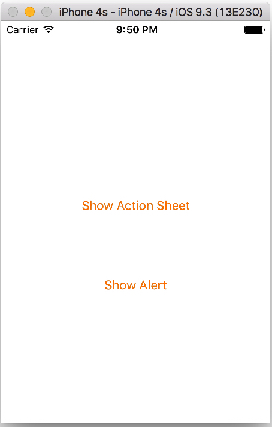

# 02 장

####1. `UIImageView`를 이용한 간단한 애니메이션

    

[이미지 다운로드](https://dl.dropboxusercontent.com/u/11130733/Images.zip)

```Swift
//  ViewController.swift
//  Animations

import UIKit

class ViewController: UIViewController {
    var counter = 1
    
    @IBOutlet var alienImage: UIImageView!

    @IBAction func updateImage(sender: AnyObject) {
        if counter == 5 {
            counter = 1
        } else {
            counter++  
        }
        alienImage.image = UIImage(named: "frame\(counter).png")
    }
    
    override func viewDidLoad() {
        super.viewDidLoad()
        // Do any additional setup after loading the view, typically from a nib.
    }
}
```


####2. `NSTimer`를 이용한 간단한 애니메이션

 

```Swift
//  ViewController.swift
//  Animations with Timer

import UIKit

class ViewController: UIViewController {
    
    var counter = 1
    var timer = NSTimer()
    var isAnimating = true
    
    @IBOutlet var alienImage: UIImageView!

    @IBAction func updateImage(sender: AnyObject) {
        
        //  에니메이션 play 중에 버튼을 누르면 Timer를 중지함
        if isAnimating == true {
            
            timer.invalidate()
            
            isAnimating = false
            
        } else {
            
            // 에니메이션 no play이면 Timer를 호출함
            timer = NSTimer.scheduledTimerWithTimeInterval(0.3, target: self, 
                    selector: Selector("doAnimation"), userInfo: nil, repeats: true)
            
            isAnimating = true
        } 
    }
    
    override func viewDidLoad() {
        super.viewDidLoad()
        
        timer = NSTimer.scheduledTimerWithTimeInterval(0.3, target: self, selector: Selector("doAnimation"), userInfo: nil, repeats: true)
        
    }
    
    func doAnimation() {
        if counter == 5 {
            counter = 1
        } else {
            counter++
        }
        
        alienImage.image = UIImage(named: "frame\(counter).png")
    }
    
//    override func viewDidLayoutSubviews() {
//        
//        alienImage.frame = CGRectMake(100, 20, 0, 0)    
//    }
//    
//    override func viewDidAppear(animated: Bool) {
//        
//        UIView.animateWithDuration(1, animations: { () -> Void in
//            self.alienImage.frame = CGRectMake(100, 20, 100, 200)         
//        })
//    }  
}
```

---
알고리즘 과제 참고 1)
```Swift
//  ViewController.swift
//  Created by 남소연 on 2016. 3. 30..

import UIKit

class ViewController: UIViewController {
    
    var counter = 0
    var timer = NSTimer()
    var isAnimating = false
    var logoImage = ["frame1.png","frame2.png","frame3.png","frame4.png","frame5.png"]
    
    @IBOutlet var rbtn2: UIButton!
    @IBOutlet var lbtn2: UIButton!
    
    @IBAction func lbtn(sender: AnyObject) {
        counter--
        
        if(counter == 0){
            lbtn2.hidden = true
        }
        
        alienImage.image = UIImage(named:logoImage[counter])
        print(counter)
        rbtn2.hidden = false
        
    }
    
    @IBAction func rbtn(sender: AnyObject) {
        counter++
        
        if(counter == logoImage.count-1){
            rbtn2.hidden = true
        }
        
        alienImage.image = UIImage(named:logoImage[counter])
        print(counter)
        lbtn2.hidden = false    
    }
    
    @IBOutlet var alienImage: UIImageView!
    
    @IBAction func updateImage(sender: AnyObject) {
         
        if isAnimating == true{
            timer.invalidate()
            isAnimating = false
        }else{
            timer = NSTimer.scheduledTimerWithTimeInterval(0.3, target: self, selector: Selector("doAnimation"), userInfo: nil, repeats: true)
            isAnimating = true
        }
        print(counter) 
    }
    
    override func viewDidLoad() {
        super.viewDidLoad()
        alienImage.image = UIImage(named:logoImage[counter])
        lbtn2.hidden = true
        
//        timer = NSTimer.scheduledTimerWithTimeInterval(0.3, target: self, selector: Selector("doAnimation"), userInfo: nil, repeats: false)
//        
//         //Do any additional setup after loading the view, typically from a nib.
    } 
    func doAnimation(){
        if counter == 5{
            counter = 1
        }else{
            counter++
        }
        alienImage.image = UIImage(named:logoImage[counter-1])      
    }
}
```

알고리즘 과제 참고 2)
```Swift
//  ViewController.swift
//  ImageView Slider
//  Created by 김종현 on 2016. 3. 19..

import UIKit

class ViewController: UIViewController {

    var myImage = ["01.png", "02.png", "03.png", "04.png", "05.png"]
    var count = 1  // 첫번째 이미지
    
    @IBOutlet var myImageView: UIImageView!
    @IBOutlet var fwdButton: UIButton!
    @IBOutlet var backButton: UIButton!
    
    @IBAction func fwdButtonPressed(sender: AnyObject) {
        
        if count < myImage.count {
            
            count++
            
            myImageView.image = UIImage(named: "0\(count).png" )
            
            print("fwd count = \(count)")
            
            if count == myImage.count {
                fwdButton.hidden = true
            }
            backButton.hidden = false
        }
    }
    
    
    @IBAction func backButtonPressed(sender: AnyObject) { 
        if count <= myImage.count {
            
            count--
            
            myImageView.image = UIImage(named: "0\(count).png" )
            
            print("back count = \(count)")
            
            if count == 1 {
                backButton.hidden = true
            }
            fwdButton.hidden = false
        }
    }
      
    override func viewDidLoad() {
        super.viewDidLoad()
        
        myImageView.image = UIImage(named: "01.png")
        myImageView.contentMode = UIViewContentMode.ScaleToFill
        //myImageView.contentMode = UIViewContentMode.ScaleAspectFill
        
        let backImage = UIImage(named: "backBtn.png")
        backButton.setImage(backImage, forState: .Normal)
        
        let fowardImage = UIImage(named: "forwardBtn.png")
        fwdButton.setImage(fowardImage, forState: .Normal)
        
        // 실행 초기에는 backButton을 hidden(첫번째 이미지 이므로)
        backButton.hidden = true
    }   
}
```
알고리즘 과제 참고 3)

```Swift
//  ViewController.swift
//  SlideShow
//  Created by 허민욱 on 2016. 3. 30..
import UIKit

class ViewController: UIViewController {
    
    @IBOutlet weak var myImageView: UIImageView!
    @IBOutlet weak var backwardButton: UIButton!
    @IBOutlet weak var forwardButton: UIButton!

    var count = 1
    var myImage = ["1.jpg", "2.jpg", "3.jpg,", "4.jpg", "5.jpg"]
    var timer = NSTimer()  // instance 생성
    var isPlaying = false
    
    @IBAction func fButtonPressed(sender: AnyObject) {
        if(count < myImage.count) {
            count++
            myImageView.image = UIImage(named: "\(count).jpg")
            backwardButton.hidden = false
            if(count == myImage.count) {
                forwardButton.hidden = true
            }
        }
    }
    
    @IBAction func bButtonPressed(sender: AnyObject) {
        if(count > 1) {
            count--
            myImageView.image = UIImage(named: "\(count).jpg")
            forwardButton.hidden = false
            if(count == 1) {
                backwardButton.hidden = true
            }
        }
    }
    
    @IBAction func autoButtonPressed(sender: AnyObject) {
        if isPlaying == true {
            timer.invalidate()
            isPlaying = false
        }
        else {
            timer = NSTimer.scheduledTimerWithTimeInterval(0.5, target: self,
                selector: "doPlaying", userInfo: nil, repeats: true)
            isPlaying = true
        }
    }
    
    func doPlaying() {
        if count == myImage.count {
            count = 1
        } else {
            count++
        }
        myImageView.image = UIImage(named: "\(count).jpg")
    }
    
    override func viewDidLoad() {
        super.viewDidLoad()
        // Do any additional setup after loading the view, typically from a nib.
        backwardButton.hidden = true
    }
}
```

**[코딩 문제 07] `UIImageView`를 이용한 슬라이드 쇼 앱 제작**

* *코딩 조건 1)*
image를 5개를 배열에 넣고, 디바이스가 landscape 형식으로 보여 지게 하라.
* *코딩 조건 2)*
Forward/Backwrad 버튼을 한번 터치할때 마다 이미지가 한장씩 순방향/역방향으로 각각 이동하며, 마지막 이미지와 첫번째 이미지를 만나면 circular 방식(1->2->3->4->5->4->3->2->1)으로 보여진다.
* *코딩 조건 3)*
이미지의 첫번째와 마지막에서 더이상의 이미지를 보여줄 수 없을때는 각각 Forward/ Backward 버튼은 각각 hidden 된다. 

*1) 첫번째 이미지*


*2) 두번째 이미지*



*3) 세번째 이미지*


**[코딩 문제 08] [코딩 문제 07]을 `NSTimer`를 이용하여 슬라리드 쇼가 될 수 있도록 Play/Stop 버튼(AutoSlider)을 추가하시오.**


**[코딩 문제 09] [코딩 문제 08]을 AutoLayou을 적용하여 아이폰 4-inch", 4.7-inch, 5.5-inch가 모두 정상적을 보여질 수 있도록 하시오.**


---

####3. `UIAlertController`



**[코딩 문제 10] 아래 실행 결과를 참고하여 UIAlertController을 사용하여 윗 버튼(Show Action Sheet)을 터치하면 ActionSheet가, 아래 버튼(Show Alert)을 터치하면 AlertView가 출력하도록 제작하시오.

 


