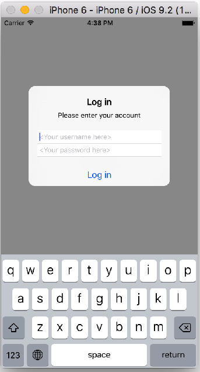
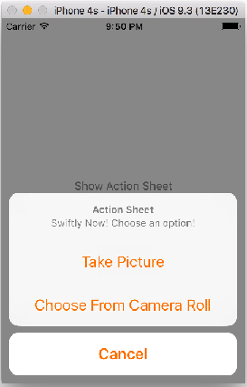

# 03 장


####3. `UIAlertController`


#### `UIActionAlert` 이벤트 처리를 위한 클로저(Closure) 사용 

*그림 참고 : www.appcoda.com*


#### Login 만들기 
  

```Swift
//  ViewController.swift
//  TextFieldAlertControllerTest

import UIKit

class ViewController: UIViewController {

    @IBAction func loginPressed(sender: AnyObject) {
        // 1. 반드시 옵셔널 변수 선언(초기화하기 않아도 됨)
        var usernameTextField: UITextField?
        var passwordTextField: UITextField?
        
        // 2.
        let alertController = UIAlertController(title: "Log in", message: "Please enter your account", preferredStyle: .Alert)
        
        // 3. 클로져를 사용한 이벤트 처리 
        let loginAction = UIAlertAction(title: "Log in", style: .Default) { (action: UIAlertAction) -> Void in
            
            if let username = usernameTextField!.text {
                print("Username = \(username)")
            } else {
                print("No Username entered")
            }
            
            if let password = passwordTextField!.text {
                print("Pasword = \(password)")
            }
        }
        
        
        //3-1 클로저의 다른 표현 
//        let loginAction = UIAlertAction(title: "Log in", style: .Default, handler: {
//            (action: UIAlertAction) -> Void in
//                if let username = usernameTextField!.text {
//                    print("Username = \(username)")
//                } else {
//                    print("No Username entered")
//                }
//                
//                if let password = passwordTextField!.text {
//                    print("Pasword = \(password)")
//                }
//
//            })
        
        //4.
        alertController.addTextFieldWithConfigurationHandler { (txtUsername: UITextField) -> Void in
            usernameTextField = txtUsername
            usernameTextField!.placeholder = "<Your username here>"
        }
        
        alertController.addTextFieldWithConfigurationHandler { (txtPassword) -> Void in
            passwordTextField = txtPassword
            passwordTextField?.secureTextEntry = true
            passwordTextField?.placeholder = "<Your password here>"
        }
        
        //5.
        alertController.addAction(loginAction)
        presentViewController(alertController, animated: true, completion: nil)
        
        
    }
    override func viewDidLoad() {
        super.viewDidLoad()
        // Do any additional setup after loading the view, typically from a nib.
    }
}
```


**[코딩 문제 10] 아래 실행 결과를 참고하여 UIAlertController을 사용하여 윗 버튼(Show Action Sheet)을 터치하면 ActionSheet가, 아래 버튼(Show Alert)을 터치하면 AlertView가 출력하도록 제작하시오.**

 


