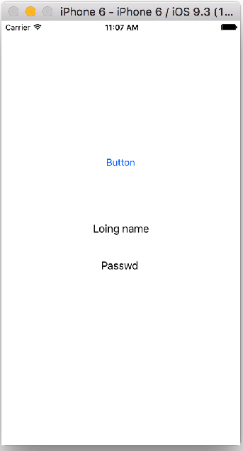
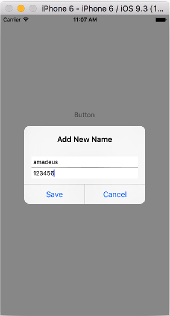
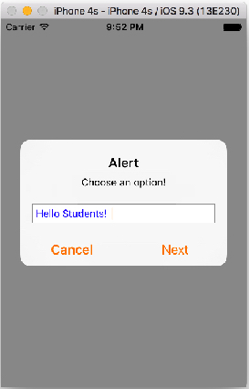

# 03 장


####3. `UIAlertController`


#### `UIActionAlert` 이벤트 처리를 위한 클로저(Closure) 사용 


#### Example 
 


```Swift
//  ViewController.swift
//  AlertControllerText
import UIKit

class ViewController: UIViewController {
    
    @IBOutlet var firstSave: UILabel!
    @IBOutlet var secondSave: UILabel!
    
    @IBAction func addButtonClicked(sender: AnyObject) {
        
        let alertController = UIAlertController(title: "Add New Name", message: "", preferredStyle: UIAlertControllerStyle.Alert)
        
        let saveAction = UIAlertAction(title: "Save", style: UIAlertActionStyle.Default, handler: {
            alert -> Void in
            
            let firstTextField = alertController.textFields![0] as UITextField
            let secondTextField = alertController.textFields![1] as UITextField 
            self.firstSave.text = firstTextField.text
            self.secondSave.text = secondTextField.text   
        })
        
        let cancelAction = UIAlertAction(title: "Cancel", style: UIAlertActionStyle.Default, handler: {
            (action : UIAlertAction!) -> Void in
            //self.view.backgroundColor = UIColor.yellowColor()
            print("Cancel Alert Action run!!!")
        })
        
        alertController.addTextFieldWithConfigurationHandler { (textField : UITextField!) -> Void in
            textField.placeholder = "Enter First Name"
        }
        
        alertController.addTextFieldWithConfigurationHandler { (textField : UITextField!) -> Void in
            textField.placeholder = "Enter Second Name"
        }
        
        alertController.addAction(saveAction)
        alertController.addAction(cancelAction)
        
        self.presentViewController(alertController, animated: true, completion: nil)
    }
    
    override func viewDidLoad() {
        super.viewDidLoad()
        // Do any additional setup after loading the view, typically from a nib.
    }
}
```


**[코딩 문제 10] 아래 실행 결과를 참고하여 UIAlertController을 사용하여 윗 버튼(Show Action Sheet)을 터치하면 ActionSheet가, 아래 버튼(Show Alert)을 터치하면 AlertView가 출력하도록 제작하시오.**

 


