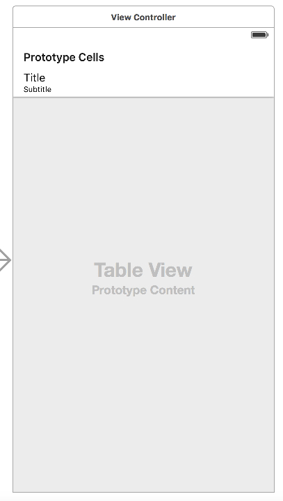
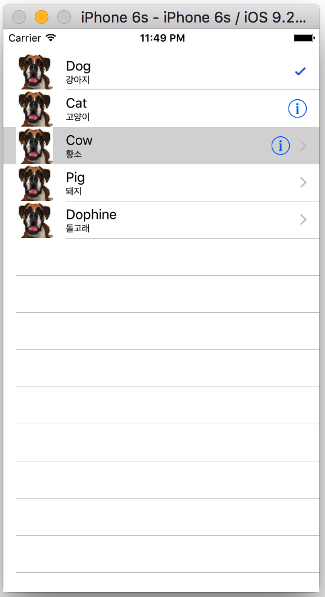
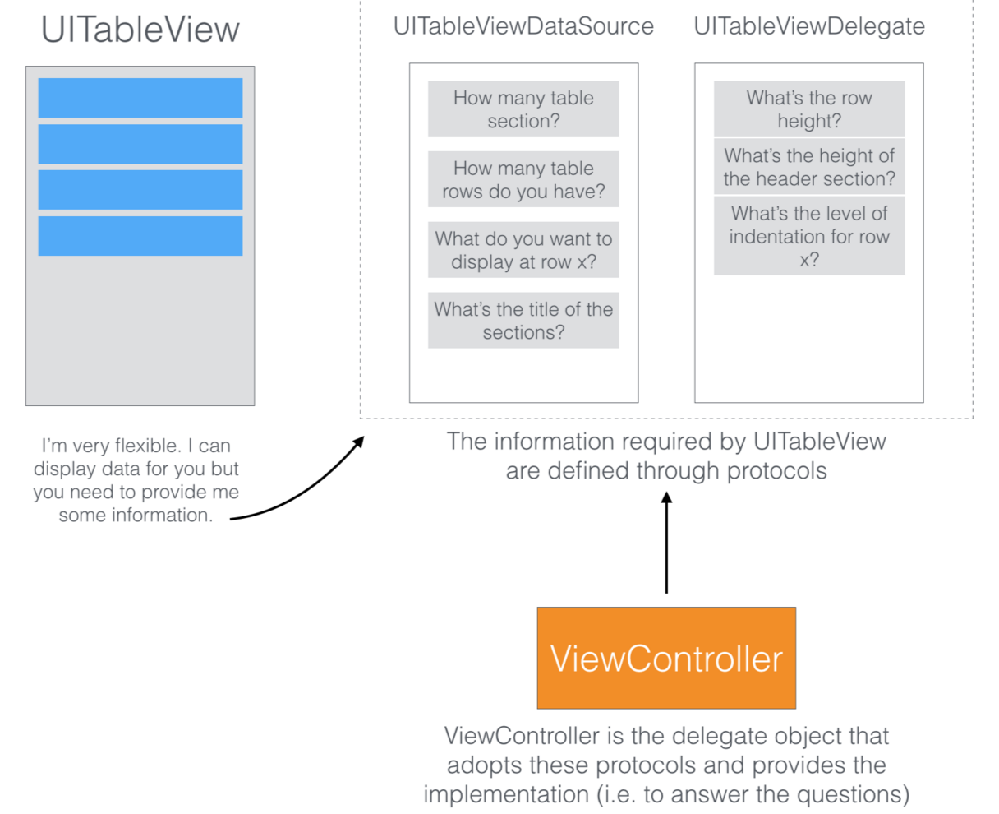
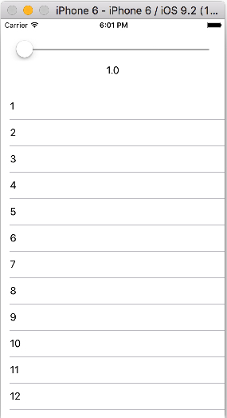
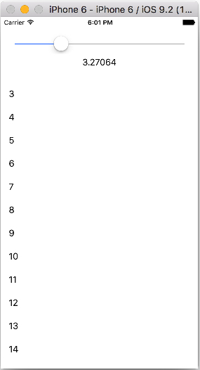
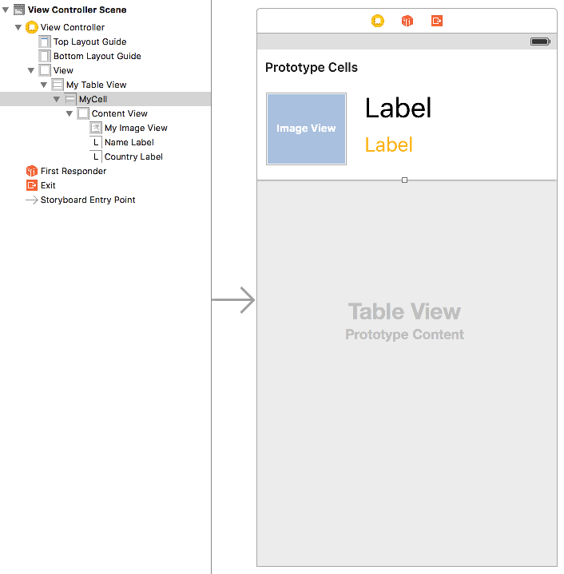
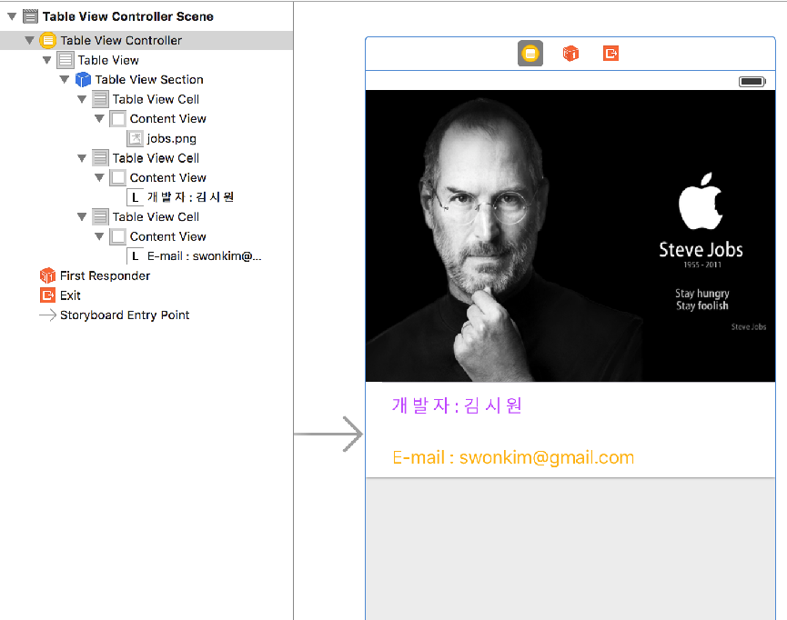

# 04 장
### Simple TableView
  


### Delegate Protocol

* 
####[`UITableViewDataSource`](https://developer.apple.com/library/ios/documentation/UIKit/Reference/UITableViewDataSource_Protocol/)
* 
####[`UITableViewDelegate`](https://developer.apple.com/library/ios/documentation/UIKit/Reference/UITableViewDelegate_Protocol/)


```Swift
//  ViewController.swift
//  Simple TableView
import UIKit

class ViewController: UIViewController, UITableViewDataSource, UITableViewDelegate {
    
    @IBOutlet var tableView: UITableView!
    
    let data = ["Dog", "Cat", "Cow", "Pig", "Dophine"]
    let subData = ["강아지", "고양이", "황소", "돼지", "돌고래"]

    override func viewDidLoad() {
        super.viewDidLoad()
        // Do any additional setup after loading the view, typically from a nib.
        
        // delegate 연결
        tableView.delegate = self
        tableView.dataSource = self
    }

    // Delegate 객체에게 Section의 갯수 생성 요청
    func numberOfSectionsInTableView(tableView: UITableView) -> Int {
        return 1
    }
    
    // Delegate 객체에게 Section 내의 row의 갯수 생성 요청
    func tableView(tableView: UITableView, numberOfRowsInSection section: Int) -> Int {
        return data.count
    }
    
    // cell의 생성 및 데이터 출력
    func tableView(tableView: UITableView, cellForRowAtIndexPath indexPath: NSIndexPath) -> UITableViewCell {
        
        let cell = tableView.dequeueReusableCellWithIdentifier("cell") as UITableViewCell!
        let row = indexPath.row
        cell?.textLabel?.text = data[row]
        cell.detailTextLabel?.text = subData[row]
        
        // cell image 넣기
        let myImage = UIImage(named: "dog50x50.png")
        //let myImageView = UIImageView(image: myImage)
        cell.imageView?.image = myImage
        
        /// Accessory Type
        if row == 0 {
            cell.accessoryType = UITableViewCellAccessoryType.Checkmark
        } else if row == 1 {
            cell.accessoryType = UITableViewCellAccessoryType.DetailButton
        } else if row == 2 {
            cell.accessoryType = UITableViewCellAccessoryType.DetailDisclosureButton
        } else {
            cell.accessoryType = UITableViewCellAccessoryType.DisclosureIndicator
        }
        
        return cell  
    }
    
    // cell을 tap 할때 index 출력
    func tableView(tableView: UITableView, didSelectRowAtIndexPath indexPath: NSIndexPath) {
        print("You selected \(indexPath.row)")
    }   
}
****
```


### 형변환(downcasting)에 대하여? **`as!, as?`**


* 
**as?**는 conditional 형으로 변환하고자 하는 형(downcast type)의 optional 값을 return 함
* 
**as!**는 forced 형으로 force-unwrap 형태로 변환 함. as!는 다운캐스팅이 항상 성공적인 것을 확신할때 사용되며, 그렇지 않을 경우 runtime 오류가 발생함 

```Swift
// ViewController의 데이터를 DetailViewController로 전달하기
    override func prepareForSegue(segue: UIStoryboardSegue, sender: AnyObject?) {
        if segue.identifier == "goDetail" {
            
            if let detailVC = segue.destinationViewController as? DetailViewController {
                
                let path = tableView.indexPathForSelectedRow
                
                // Data를 label에 넘기기
                detailVC.myData = data[(path?.row)!]
                
                // subData를 네비게이션 바의 title에 넘기기
                detailVC.title = subData[(path?.row)!]
                
                // 이미지 넘기기
                detailVC.detailImage = data[(path?.row)!] + ".jpg"
                
            }
        }
    }

```


### UISlider을 이용한 Times Table 만들기

 

```Swift
//  ViewController.swift
//  Slider Value

import UIKit

class ViewController: UIViewController, UITableViewDataSource, UITableViewDelegate {

    @IBOutlet var sliderValue: UISlider!
    @IBOutlet var sliderOutput: UILabel!
    @IBOutlet var tableView: UITableView!
    
    @IBAction func sliderMove(sender: AnyObject) {
        
        sliderOutput.text = String(sliderValue.value)
        
        // Reloads the rows and sections of the table view.
        tableView.reloadData()
    }
    
    
    override func viewDidLoad() {
        super.viewDidLoad()
        // Do any additional setup after loading the view, typically from a nib.
        tableView.delegate = self
        tableView.dataSource = self
        
    }

    
    func tableView(tableView: UITableView, numberOfRowsInSection section: Int) -> Int {
        return 20
    }
    
    func tableView(tableView: UITableView, cellForRowAtIndexPath indexPath: NSIndexPath) -> UITableViewCell {
        let cell = UITableViewCell(style: .Default, reuseIdentifier: "RE")
        let timeTableVal = Int(sliderValue.value)
        cell.textLabel?.text = String(timeTableVal + indexPath.row)
        
        return cell
        
    } 
}
```

### Custom Cell 만들기



``` Swift
//  ViewController.swift
//  Custom Table Test

import UIKit

class ViewController: UIViewController, UITableViewDataSource, UITableViewDelegate {

    var name = ["cat", "dog", "pig", "dolphin", "cow"]
    var country = ["KOREA", "JAPAN", "ITALY", "USA", "CHINA"]
    
    @IBOutlet var myTableView: UITableView!
        
    override func viewDidLoad() {
        super.viewDidLoad()
        // Do any additional setup after loading the view, typically from a nib.
        myTableView.delegate = self
        myTableView.dataSource = self
    }

    // delegate method 구현
    //1. section 수 요청은 optional이므로 구현하지 않으면 자동으로 1
    
    //2. row 수 요청
    func tableView(tableView: UITableView, numberOfRowsInSection section: Int) -> Int {
        return name.count
    }
    
    //3. cell의 수만큼 메모리 할당 및 재활용
    func tableView(tableView: UITableView, cellForRowAtIndexPath indexPath: NSIndexPath) -> UITableViewCell {
        
        // UITableViewCell을 Custom Cell인 MyTableViewCell로 다운 캐스팅(형변환) 함
        let cell = myTableView.dequeueReusableCellWithIdentifier("MyCell", forIndexPath: indexPath) as! MyTableViewCell
        
        cell.myImageView.image = UIImage(named: name[indexPath.row] + ".jpg")
        cell.nameLabel.text = name[indexPath.row]
        cell.countryLabel.text = country[indexPath.row]
        
        return cell
    }
}

```


---

```Swift
//  MyTableViewCell.swift

import UIKit

class MyTableViewCell: UITableViewCell {

    @IBOutlet var myImageView: UIImageView!
    @IBOutlet var nameLabel: UILabel!
    @IBOutlet var countryLabel: UILabel!
    
    override func awakeFromNib() {
        super.awakeFromNib()
        // Initialization code
    }

    override func setSelected(selected: Bool, animated: Bool) {
        super.setSelected(selected, animated: animated)

        // Configure the view for the selected state
    }
}
```

### Static Cell vs. Dynamic Prototype Cell

* Static Cell은 `UITableViewController`에서만 사용 가능(`UITableView`를 상속 받은 `UIViewController`의 경우는 에러가 발생하여 사용 불가능함)
* Dynamic Cell과는 달리 Cell을 delegate 함수들을 사용하여 동적으로 생성하지 않음(`UITableViewDataSource, UITableViewDelegate` 함수를 사용하지 않음)
* 간단한 정적인 테이블을 제작할 때 편리함




