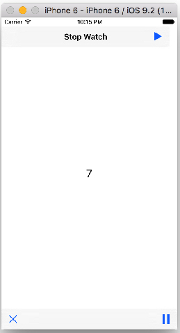
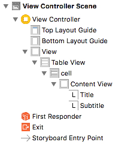
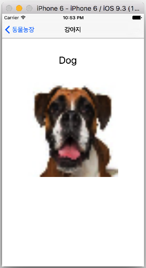
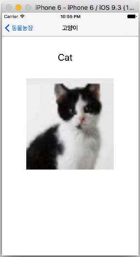

# 04 장
####Stop Watch 만들기
   

 

```Swift
//  ViewController.swift
//  Stop Watch
import UIKit

class ViewController: UIViewController {
    var timer = NSTimer()
    var counter = 0
    @IBOutlet var timeLabel: UILabel!

    @IBAction func timePlay(sender: AnyObject) {
        
        timer = NSTimer.scheduledTimerWithTimeInterval(1, target: self, selector: Selector("updateTime"), userInfo: nil, repeats: true)  
    }
    
    @IBAction func timeStop(sender: AnyObject) { 
        timer.invalidate()
        counter = 0
        timeLabel.text = String(counter)
    }
    
    @IBAction func timePause(sender: AnyObject) {  
        timer.invalidate()
    }
    
    func updateTime() {
        counter++
        timeLabel.text = String(counter)  
    }
    
    override func viewDidLoad() {
        super.viewDidLoad()
        // Do any additional setup after loading the view, typically from a nib.
    } 
}
```

####Simple TableView

    


### Delegate Protocol

* 
###[`UITableViewDataSource`](https://developer.apple.com/library/ios/documentation/UIKit/Reference/UITableViewDataSource_Protocol/)
* 
###[`UITableViewDelegate`](https://developer.apple.com/library/ios/documentation/UIKit/Reference/UITableViewDelegate_Protocol/)


```Swift
//  ViewController.swift
//  Simple TableView
import UIKit

class ViewController: UIViewController, UITableViewDataSource, UITableViewDelegate {
    
    @IBOutlet var tableView: UITableView!
    
    let data = ["Dog", "Cat", "Cow", "Pig", "Dophine"]
    let subData = ["강아지", "고양이", "황소", "돼지", "돌고래"]

    override func viewDidLoad() {
        super.viewDidLoad()
        // Do any additional setup after loading the view, typically from a nib.
        
        // delegate 연결
        tableView.delegate = self
        tableView.dataSource = self
    }

    // Delegate 객체에게 Section의 갯수 생성 요청
    func numberOfSectionsInTableView(tableView: UITableView) -> Int {
        return 1
    }
    
    // Delegate 객체에게 Section 내의 row의 갯수 생성 요청
    func tableView(tableView: UITableView, numberOfRowsInSection section: Int) -> Int {
        return data.count
    }
    
    // cell의 생성 및 데이터 출력
    func tableView(tableView: UITableView, cellForRowAtIndexPath indexPath: NSIndexPath) -> UITableViewCell {
        
        let cell = tableView.dequeueReusableCellWithIdentifier("cell") as UITableViewCell!
        let row = indexPath.row
        cell?.textLabel?.text = data[row]
        cell.detailTextLabel?.text = subData[row]
        
        // cell image 넣기
        let myImage = UIImage(named: "dog50x50.png")
        //let myImageView = UIImageView(image: myImage)
        cell.imageView?.image = myImage
        
        /// Accessory Type
        if row == 0 {
            cell.accessoryType = UITableViewCellAccessoryType.Checkmark
        } else if row == 1 {
            cell.accessoryType = UITableViewCellAccessoryType.DetailButton
        } else if row == 2 {
            cell.accessoryType = UITableViewCellAccessoryType.DetailDisclosureButton
        } else {
            cell.accessoryType = UITableViewCellAccessoryType.DisclosureIndicator
        }
        
        return cell  
    }
    
    // cell을 tap 할때 index 출력
    func tableView(tableView: UITableView, didSelectRowAtIndexPath indexPath: NSIndexPath) {
        print("You selected \(indexPath.row)")
    }   
}

```

#### UISlider을 이용한 Times Table 만들기

 

```Swift
//  ViewController.swift
//  Slider Value

import UIKit

class ViewController: UIViewController, UITableViewDataSource, UITableViewDelegate {

    @IBOutlet var sliderValue: UISlider!
    @IBOutlet var sliderOutput: UILabel!
    @IBOutlet var tableView: UITableView!
    
    @IBAction func sliderMove(sender: AnyObject) {
        
        sliderOutput.text = String(sliderValue.value)
        
        // Reloads the rows and sections of the table view.
        tableView.reloadData()
    }
    
    
    override func viewDidLoad() {
        super.viewDidLoad()
        // Do any additional setup after loading the view, typically from a nib.
        tableView.delegate = self
        tableView.dataSource = self
        
    }

    
    func tableView(tableView: UITableView, numberOfRowsInSection section: Int) -> Int {
        return 20
    }
    
    func tableView(tableView: UITableView, cellForRowAtIndexPath indexPath: NSIndexPath) -> UITableViewCell {
        let cell = UITableViewCell(style: .Default, reuseIdentifier: "RE")
        let timeTableVal = Int(sliderValue.value)
        cell.textLabel?.text = String(timeTableVal + indexPath.row)
        
        return cell
        
    } 
}
```

####뷰(`UIViewController`) 전환하기, 뷰 간 데이터 전달하기(`prepareForSegue`)

   


``` Swift
//  ViewController.swift
//  ViewController Switching & Data Passing
//
//  Created by 김종현 on 2016. 4. 13..
//  Copyright © 2016년 김종현. All rights reserved.
//

import UIKit

class ViewController: UIViewController, UITableViewDataSource, UITableViewDelegate {
    
    @IBOutlet var tableView: UITableView!
    
    var data = ["Dog", "Cat", "Cow", "Pig", "dolphin"]
    var subData = ["강아지", "고양이", "황소", "돼지", "돌고래"]

    override func viewDidLoad() {
        super.viewDidLoad()
        // Do any additional setup after loading the view, typically from a nib.
        
        //4.   delegate 연결
        tableView.delegate = self
        tableView.dataSource = self
    }

    // 1. Delegate 객체에게 Section의 갯수 생성 요청
    func numberOfSectionsInTableView(tableView: UITableView) -> Int {
        return 1
    }
    
    // 2. Delegate 객체에게 Section 내의 row의 갯수 생성 요청
    func tableView(tableView: UITableView, numberOfRowsInSection section: Int) -> Int {
        return data.count
    }
    
    // 3. cell의 메모리 할당 생성 및 데이터 출력
    func tableView(tableView: UITableView, cellForRowAtIndexPath indexPath: NSIndexPath) -> UITableViewCell {
        
        //let cell = tableView.dequeueReusableCellWithIdentifier("cell") as UITableViewCell!
        
        let cell:UITableViewCell = tableView.dequeueReusableCellWithIdentifier("cell", forIndexPath: indexPath)
        //let row = indexPath.row
        
        cell.textLabel?.text = data[indexPath.row]
        cell.detailTextLabel?.text = subData[indexPath.row]
        
        // cell image 넣기
        let myImage = UIImage(named: data[indexPath.row]+".jpg")
        //let myImageView = UIImageView(image: myImage)
        cell.imageView?.image = myImage
        
        /// Accessory Type
//        if indexPath.row == 0 {
//            cell.accessoryType = UITableViewCellAccessoryType.Checkmark
//        } else if indexPath.row == 1 {
//            cell.accessoryType = UITableViewCellAccessoryType.DetailButton
//        } else if indexPath.row == 2 {
//            cell.accessoryType = UITableViewCellAccessoryType.DetailDisclosureButton
//        } else {
//            cell.accessoryType = UITableViewCellAccessoryType.DisclosureIndicator
//        }
        
        return cell
        
    }
    
    // cell 지우기
    func tableView(tableView: UITableView, commitEditingStyle editingStyle: UITableViewCellEditingStyle, forRowAtIndexPath indexPath: NSIndexPath) {
    
        if editingStyle == UITableViewCellEditingStyle.Delete {
            data.removeAtIndex(indexPath.row)
            tableView.reloadData()
        }
    }
    
    // ViewController의 데이터를 DetailViewController로 전달하기
    override func prepareForSegue(segue: UIStoryboardSegue, sender: AnyObject?) {
        if segue.identifier == "goDetail" {
            if let detailVC = segue.destinationViewController as? DetailViewController {
                
                let path = tableView.indexPathForSelectedRow
                
                // Data를 label에 넘기기
                detailVC.myData = data[(path?.row)!]
                
                // subData를 네비게이션 바의 title에 넘기기
                detailVC.title = subData[(path?.row)!]
                
                // 이미지 넘기기
                detailVC.detailImage = data[(path?.row)!] + ".jpg"
                
            }
        }
    }
    
    // cell을 tap 할때 index 출력
    // UITableViewDelegate에 있는 메소드
    //    func tableView(tableView: UITableView, didSelectRowAtIndexPath indexPath: NSIndexPath) {
    //        print("You selected \(indexPath.section)th section... \(indexPath.row)th row")
    //
    //
    //    }
    
    // section Header 설정
    // UITableViewDataSource에 있는 메소드
    //    func tableView(tableView: UITableView, titleForHeaderInSection section: Int) -> String? {
    //        return "Section \(section)"
    //    } 
}
```


**[코딩 문제 11] Stop Watch 업그레이드 하기**
* 
**현재 제작한 Stop Watch는 play를 하고 있는 상태에서 다시 play를 하면 Timer가 중복으로 작동하여 시계를 두배 빠르게 작동하게 한다. 이러한 문제점을 해결하시오(play 상태에서는 play를 하지 못하도록 하고 Alert로 알려 주기 바람)**
* 
**AutoLayout을 사용하여 모든 디바이스 크기 및 회전에도 대응하도록 하시오.**


