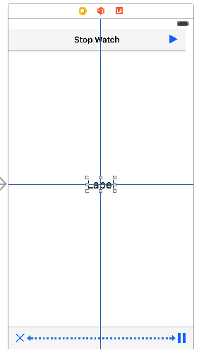
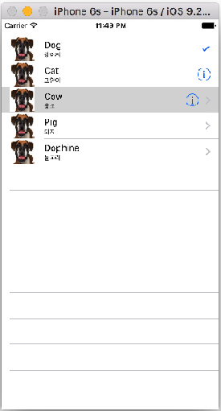

# 04 장
####Stop Watch 만들기
   

 


####UITableView

    


### Delegate Protocol

* 
###[`UITableViewDataSource`](https://developer.apple.com/library/ios/documentation/UIKit/Reference/UITableViewDataSource_Protocol/)
* 
###[`UITableViewDelegate`](https://developer.apple.com/library/ios/documentation/UIKit/Reference/UITableViewDelegate_Protocol/)


```Swift
```Swift
//  ViewController.swift
//  Simple TableView
import UIKit

class ViewController: UIViewController, UITableViewDataSource, UITableViewDelegate {
    
    @IBOutlet var tableView: UITableView!
    
    let data = ["Dog", "Cat", "Cow", "Pig", "Dophine"]
    let subData = ["강아지", "고양이", "황소", "돼지", "돌고래"]

    override func viewDidLoad() {
        super.viewDidLoad()
        // Do any additional setup after loading the view, typically from a nib.
        
        // delegate 연결
        tableView.delegate = self
        tableView.dataSource = self
    }

    // Delegate 객체에게 Section의 갯수 생성 요청
    func numberOfSectionsInTableView(tableView: UITableView) -> Int {
        return 1
    }
    
    // Delegate 객체에게 Section 내의 row의 갯수 생성 요청
    func tableView(tableView: UITableView, numberOfRowsInSection section: Int) -> Int {
        return data.count
    }
    
    // cell의 생성 및 데이터 출력
    func tableView(tableView: UITableView, cellForRowAtIndexPath indexPath: NSIndexPath) -> UITableViewCell {
        
        let cell = tableView.dequeueReusableCellWithIdentifier("cell") as UITableViewCell!
        let row = indexPath.row
        cell?.textLabel?.text = data[row]
        cell.detailTextLabel?.text = subData[row]
        
        // cell image 넣기
        let myImage = UIImage(named: "dog50x50.png")
        //let myImageView = UIImageView(image: myImage)
        cell.imageView?.image = myImage
        
        /// Accessory Type
        if row == 0 {
            cell.accessoryType = UITableViewCellAccessoryType.Checkmark
        } else if row == 1 {
            cell.accessoryType = UITableViewCellAccessoryType.DetailButton
        } else if row == 2 {
            cell.accessoryType = UITableViewCellAccessoryType.DetailDisclosureButton
        } else {
            cell.accessoryType = UITableViewCellAccessoryType.DisclosureIndicator
        }
        
        return cell  
    }
    
    // cell을 tap 할때 index 출력
    func tableView(tableView: UITableView, didSelectRowAtIndexPath indexPath: NSIndexPath) {
        print("You selected \(indexPath.row)")
    }   
}

```
**[코딩 문제 11] Stop Watch 오류 고치기**
1. 현재 제작한 Stop Watch는 play를 하고 있는 상태에서 다시 play를 하면 Timer가 중복으로 작동하여 시계를 두배 빠르게 작동하게 한다. 이러한 문제점을 해결하시오(play 상태에서는 play를 하지 못하도록 하고 Alert로 알려 주기 바람)
2. AutoLayout을 사용하여 모든 디바이스 크기 및 회전에도 대응하도록 하시오


