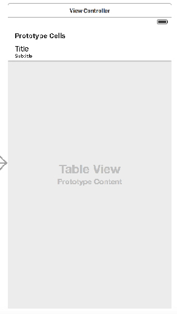

# 04 장
####Stop Watch 만들기
```Swift
//  ViewController.swift
//  Stop Watch 

import UIKit

class ViewController: UIViewController {
    var timer = NSTimer()
    var counter = 0
    @IBOutlet var timeLabel: UILabel!

    @IBAction func timePlay(sender: AnyObject) {
        
        timer = NSTimer.scheduledTimerWithTimeInterval(1, target: self, 
        selector: Selector("updateTime"), userInfo: nil, repeats: true)    
    }
    
    @IBAction func timeStop(sender: AnyObject) {   
        timer.invalidate()
        counter = 0
        timeLabel.text = String(counter)
    }
    
    @IBAction func timePause(sender: AnyObject) {   
        timer.invalidate()
    }
    
    func updateTime() {
        counter++
        timeLabel.text = String(counter)    
    }
    
    override func viewDidLoad() {
        super.viewDidLoad()
        // Do any additional setup after loading the view, typically from a nib.
    } 
}
```

####UITableView

    


### Delegate Protocol

* 
###[`UITableViewDataSource`](https://developer.apple.com/library/ios/documentation/UIKit/Reference/UITableViewDataSource_Protocol/)
* 
###[`UITableViewDataSource`](###[`UITableViewDataSource`](https://developer.apple.com/library/ios/documentation/UIKit/Reference/UITableViewDataSource_Protocol/)


```Swift
//  ViewController.swift
//  Simple TableView

import UIKit

class ViewController: UIViewController, UITableViewDataSource, UITableViewDelegate {
    
    @IBOutlet var tableView: UITableView!
    
    let data = ["A", "B", "C"]
    let subData = ["에이", "비", "씨"]

    override func viewDidLoad() {
        super.viewDidLoad()
        // Do any additional setup after loading the view, typically from a nib.
        
        // delegate 연결
        tableView.delegate = self
        tableView.dataSource = self
    }

    // Delegate 객체에게 Section의 갯수 생성 요청
    func numberOfSectionsInTableView(tableView: UITableView) -> Int {
        return 1
    }
    
    // Delegate 객체에게 Section 내의 row의 갯수 생성 요청
    func tableView(tableView: UITableView, numberOfRowsInSection section: Int) -> Int {
        return data.count
    }
    
    // cell의 생성 및 데이터 출력
    func tableView(tableView: UITableView, cellForRowAtIndexPath indexPath: NSIndexPath) -> UITableViewCell {
        
        let cell = tableView.dequeueReusableCellWithIdentifier("cell") as UITableViewCell!
        let row = indexPath.row
        cell?.textLabel?.text = data[row]
        cell.detailTextLabel?.text = subData[row]
        
        return cell    
    }
    
    // cell을 tap 할때 index 출력
    func tableView(tableView: UITableView, didSelectRowAtIndexPath indexPath: NSIndexPath) {
        print("You selected \(indexPath.row)")
    }
}
```

