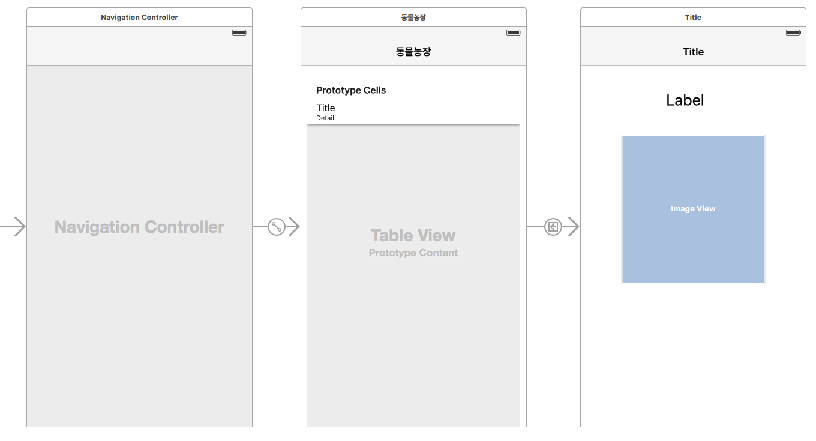
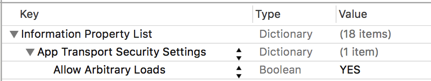

# 05 장

### `UINavigationController`을 이용한 뷰(`UIViewController`) 전환, 뷰 간 데이터 전달하기(`prepareForSegue`)

   



``` Swift
//  ViewController.swift
//  ViewController Switching & Data Passing
//
//  Created by 김종현 on 2016. 4. 13..
//  Copyright © 2016년 김종현. All rights reserved.
//

import UIKit

class ViewController: UIViewController, UITableViewDataSource, UITableViewDelegate {
    
    @IBOutlet var tableView: UITableView!
    
    var data = ["Dog", "Cat", "Cow", "Pig", "dolphin"]
    var subData = ["강아지", "고양이", "황소", "돼지", "돌고래"]

    override func viewDidLoad() {
        super.viewDidLoad()
        // Do any additional setup after loading the view, typically from a nib.
        
        //4.   delegate 연결
        tableView.delegate = self
        tableView.dataSource = self
    }

    // 1. Delegate 객체에게 Section의 갯수 생성 요청
    func numberOfSectionsInTableView(tableView: UITableView) -> Int {
        return 1
    }
    
    // 2. Delegate 객체에게 Section 내의 row의 갯수 생성 요청
    func tableView(tableView: UITableView, numberOfRowsInSection section: Int) -> Int {
        return data.count
    }
    
    // 3. cell의 메모리 할당 생성 및 데이터 출력
    func tableView(tableView: UITableView, cellForRowAtIndexPath indexPath: NSIndexPath) -> UITableViewCell {
        
        //let cell = tableView.dequeueReusableCellWithIdentifier("cell") as UITableViewCell!
        
        let cell:UITableViewCell = tableView.dequeueReusableCellWithIdentifier("cell", forIndexPath: indexPath)
        //let row = indexPath.row
        
        cell.textLabel?.text = data[indexPath.row]
        cell.detailTextLabel?.text = subData[indexPath.row]
        
        // cell image 넣기
        let myImage = UIImage(named: data[indexPath.row]+".jpg")
        //let myImageView = UIImageView(image: myImage)
        cell.imageView?.image = myImage
        
        /// Accessory Type
//        if indexPath.row == 0 {
//            cell.accessoryType = UITableViewCellAccessoryType.Checkmark
//        } else if indexPath.row == 1 {
//            cell.accessoryType = UITableViewCellAccessoryType.DetailButton
//        } else if indexPath.row == 2 {
//            cell.accessoryType = UITableViewCellAccessoryType.DetailDisclosureButton
//        } else {
//            cell.accessoryType = UITableViewCellAccessoryType.DisclosureIndicator
//        }
        
        return cell
        
    }
    
    // cell 지우기
    func tableView(tableView: UITableView, commitEditingStyle editingStyle: UITableViewCellEditingStyle, forRowAtIndexPath indexPath: NSIndexPath) {
    
        if editingStyle == UITableViewCellEditingStyle.Delete {
            data.removeAtIndex(indexPath.row)
            tableView.reloadData()
        }
    }
    
    // ViewController의 데이터를 DetailViewController로 전달하기
    override func prepareForSegue(segue: UIStoryboardSegue, sender: AnyObject?) {
        if segue.identifier == "goDetail" {
            if let detailVC = segue.destinationViewController as? DetailViewController {
                
                let path = tableView.indexPathForSelectedRow
                
                // Data를 label에 넘기기
                detailVC.myData = data[(path?.row)!]
                
                // subData를 네비게이션 바의 title에 넘기기
                detailVC.title = subData[(path?.row)!]
                
                // 이미지 넘기기
                detailVC.detailImage = data[(path?.row)!] + ".jpg"
                
            }
        }
    }
    
    // cell을 tap 할때 index 출력
    // UITableViewDelegate에 있는 메소드
    //    func tableView(tableView: UITableView, didSelectRowAtIndexPath indexPath: NSIndexPath) {
    //        print("You selected \(indexPath.section)th section... \(indexPath.row)th row")
    //
    //
    //    }
    
    // section Header 설정
    // UITableViewDataSource에 있는 메소드
    //    func tableView(tableView: UITableView, titleForHeaderInSection section: Int) -> String? {
    //        return "Section \(section)"
    //    } 
}

//  DetailViewController.swift

import UIKit

class DetailViewController: UIViewController {

    @IBOutlet var detailData: UILabel!
    @IBOutlet var myImageView: UIImageView!
    
    var myData:String?
    var mySubData:String?
    var detailImage:String?
    
    override func viewDidLoad() {
        super.viewDidLoad()

        // Do any additional setup after loading the view.
        detailData.text = myData
        //title = "title Test"
        myImageView.image = UIImage(named: detailImage!)
    }
}
```


### `UITabBarController` 사용하기
 

* **[Starter file download](https://dl.dropboxusercontent.com/u/11130733/Lec_2016_public/Simple%20TableView.zip)**


```Swift
//  ViewController.swift
//  ViewController Switching & Data Passing

import UIKit

class ViewController: UIViewController, UITableViewDataSource, UITableViewDelegate {
    
    @IBOutlet var tableView: UITableView!
    
    var data = ["Dog", "Cat", "Cow", "Pig", "dolphin"]
    var subData = ["강아지", "고양이", "황소", "돼지", "돌고래"]

    override func viewDidLoad() {
        super.viewDidLoad()
        // Do any additional setup after loading the view, typically from a nib.
        
        //4.   delegate 연결
        tableView.delegate = self
        tableView.dataSource = self
    }

    // 1. Delegate 객체에게 Section의 갯수 생성 요청
    func numberOfSectionsInTableView(tableView: UITableView) -> Int {
        return 1
    }
    
    // 2. Delegate 객체에게 Section 내의 row의 갯수 생성 요청
    func tableView(tableView: UITableView, numberOfRowsInSection section: Int) -> Int {
        return data.count
    }
    
    // 3. cell의 메모리 할당 생성 및 데이터 출력
    func tableView(tableView: UITableView, cellForRowAtIndexPath indexPath: NSIndexPath) -> UITableViewCell {
        
        //let cell = tableView.dequeueReusableCellWithIdentifier("cell") as UITableViewCell!
        
        let cell:UITableViewCell = tableView.dequeueReusableCellWithIdentifier("cell", forIndexPath: indexPath)
        //let row = indexPath.row
        
        cell.textLabel?.text = data[indexPath.row]
        cell.detailTextLabel?.text = subData[indexPath.row]
        
        // cell image 넣기
        let myImage = UIImage(named: data[indexPath.row]+".jpg")
        //let myImageView = UIImageView(image: myImage)
        cell.imageView?.image = myImage
        
        return cell
        
    }
    
    // cell 지우기
    func tableView(tableView: UITableView, commitEditingStyle editingStyle: UITableViewCellEditingStyle, forRowAtIndexPath indexPath: NSIndexPath) {
    
        if editingStyle == UITableViewCellEditingStyle.Delete {
            data.removeAtIndex(indexPath.row)
            tableView.reloadData()
        }
    }
    
    // ViewController의 데이터를 DetailViewController로 전달하기
    override func prepareForSegue(segue: UIStoryboardSegue, sender: AnyObject?) {
        if segue.identifier == "goDetail" {
            
            if let detailVC = segue.destinationViewController as? DetailViewController {
                
                let path = tableView.indexPathForSelectedRow
                
                // Data를 label에 넘기기
                detailVC.myData = data[(path?.row)!]
                
                // subData를 네비게이션 바의 title에 넘기기
                detailVC.title = subData[(path?.row)!]
                
                // 이미지 넘기기
                detailVC.detailImage = data[(path?.row)!] + ".jpg"
                
            }
        }
    }
}
```


---

```Swift
//  DetailViewController.swift

import UIKit

class DetailViewController: UIViewController {

    @IBOutlet var detailData: UILabel!
    @IBOutlet var myImageView: UIImageView!
    
    var myData:String?
    var mySubData:String?
    var detailImage:String?
    
    override func viewDidLoad() {
        super.viewDidLoad()

        // Do any additional setup after loading the view.
        detailData.text = myData
        //title = "title Test"
        myImageView.image = UIImage(named: detailImage!)
    }
}
```

---
```Swift
//  WebViewController.swift

import UIKit

class WebViewController: UIViewController {

    @IBOutlet var myWebView: UIWebView!
    
    override func viewDidLoad() {
        super.viewDidLoad()

        // Do any additional setup after loading the view.
        
        if let url = NSURL(string: "https://www.instagram.com/explore/tags/animal/") {
            let request = NSURLRequest(URL: url)
            myWebView.loadRequest(request)
        }
        
            // forced unwrapping
            let url = NSURL(string: "https://www.instagram.com/explore/tags/animal/")
            let request = NSURLRequest(URL: url!)
            myWebView.loadRequest(request)

    }
}
```
* iOS 앱에서 웹(HTTP) 페이지를 접근하기 위한 보안 설정 방법(info.plist 화일 편집)



**[코딩 문제 12]  Segue를 이용하여 ViewController 간의 데이터 넘겨 주기**

* Button을 터치하면 두개의 ViewController 간 Button(I love iOS, Happy Coding)에 있는 title 스트링 값을 전달하여 Lable(I love iOS, Happy Coding)에 출력한다.


`FirstViewController`               


`SecondViewController`


`FirstViewController`

 
