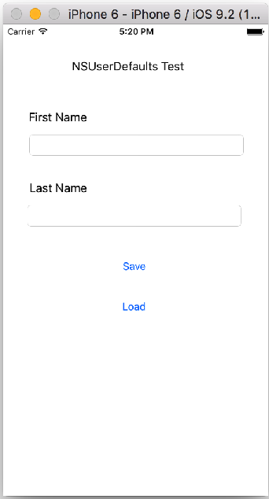
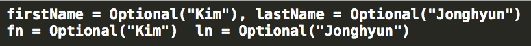

# 06 장
### NSUserDefaults

```Swift
// NSUserDefault에 데이터 저장하기
let defaults = NSUserDefaults.standardUserDefaults()
defaults.setObject("Some data", forKey: "someDataKey")
```
```Swift
// 데이터 저장 functions
func setBool(value: Bool, forKey defaultName: String)
func setInteger(value: Int, forKey defaultName: String)
func setFloat(value: Float, forKey defaultName: String)
func setDouble(value: Double, forKey defaultName: String)
func setObject(value: AnyObject?, forKey defaultName: String)
func setURL(url: NSURL, forKey defaultName: String)
```

```Swift
// NSUser Default로 부터 데이터 읽기
let defaults = NSUserDefaults.standardUserDefaults()
if let someData = defaults.stringForKey("someDataKey")
{
    // do something with someData
}
```
```Swift
// 데이터 읽기 functions
func boolForKey(defaultName: String) -> Bool
func integerForKey(defaultName: String) -> Int
func floatForKey(defaultName: String) -> Float
func doubleForKey(defaultName: String) -> Double
func objectForKey(defaultName: String) -> AnyObject?
func URLForKey(defaultName: String) -> NSURL?
func dataForKey(defaultName: String) -> NSData?
func stringForKey(defaultName: String) -> String?
func stringArrayForKey(defaultName: String) -> [AnyObject]?
func arrayForKey(defaultName: String) -> [AnyObject]?
func dictionaryForKey(defaultName: String) -> [NSObject : AnyObject]?
```


---


```Swift
//  ViewController.swift
//  Permanent Storage

import UIKit

class ViewController: UIViewController {

    override func viewDidLoad() {
        super.viewDidLoad()
        // Do any additional setup after loading the view, typically from a nib.
        
        NSUserDefaults.standardUserDefaults().setObject("jhkim", forKey: "Name")
        
        let userName = NSUserDefaults.standardUserDefaults().objectForKey("Name")! as! String
        
        print(userName)
        
        NSUserDefaults.standardUserDefaults().setInteger(12345, forKey: "Passwd")
        
        let password = NSUserDefaults.standardUserDefaults().objectForKey("Passwd")
        
        print(password!)
        
        
        let arr = [1, 2, 3, 4]
        
        NSUserDefaults.standardUserDefaults().setObject(arr, forKey: "array")
        
        let returnedArray = NSUserDefaults.standardUserDefaults().objectForKey("array")! as! NSArray
        
        for x in returnedArray {
            print(x)
        }   
    }
}
```
**output**

jhkim
12345

1
2
3
4


---

  

 
  


 

```Swift
//  ViewController.swift
//  NSUserDefaults Test

import UIKit

class ViewController: UIViewController, UITextFieldDelegate {
    @IBOutlet var firstName: UITextField!
    @IBOutlet var lastName: UITextField!
    @IBOutlet var clearButton: UIButton!
    @IBAction func saveBtnClick(sender: AnyObject) {
        
        let defaults = NSUserDefaults.standardUserDefaults()
        
        defaults.setObject(firstName.text, forKey: "firstName")
        defaults.setObject(lastName.text, forKey: "lastName")
        
        print("firstName = \(firstName.text), lastName = \(lastName.text)") 
    }
    
    func loadDefaults() {
        let defaults = NSUserDefaults.standardUserDefaults()
        
        // forced downcasting vs. conditional downcasting
        firstName.text = defaults.objectForKey("firstName") as? String
        lastName.text = defaults.objectForKey("lastName") as? String
        
        print("fn = \(firstName.text)  ln = \(lastName.text)")
    }
    
    @IBAction func clearBtnClick(sender: AnyObject) {
        if firstName.text == "" {
            loadDefaults()
            clearButton.setTitle("Clear", forState: .Normal)
        }
        else {
            firstName.text = ""
            lastName.text = ""
            clearButton.setTitle("Load", forState: .Normal)
        }
    }
    
    override func viewDidLoad() {
        super.viewDidLoad()
        // Do any additional setup after loading the view, typically from a nib.
        firstName.delegate = self
        lastName.delegate = self
    }
    
    override func touchesBegan(touches: Set<UITouch>, withEvent event: UIEvent?) {
        view.endEditing(true)
    }
    
    func textFieldShouldReturn(textField: UITextField) -> Bool {
        firstName.resignFirstResponder()
        lastName.resignFirstResponder()
        return true
    } 
}
```

### 메모장(To-Do-List) 만들기

 

```Swift
//  FirstViewController.swift
//  To Do List

import UIKit
var toDoList = [String]()

class FirstViewController: UIViewController, UITableViewDelegate {
    
    @IBOutlet var toDoListTable: UITableView!

    override func viewDidLoad() {
        super.viewDidLoad()
        
        // 앱 구동 초기 기존에 NSUserDefaults에 저장된 데이터를 불러와 toDoList 배열에 저장함
        if NSUserDefaults.standardUserDefaults().objectForKey("toDoList") != nil {
        
            toDoList = NSUserDefaults.standardUserDefaults().objectForKey("toDoList") as! [String]
        }
    }

    // 테이블뷰 생성
    func tableView(tableView: UITableView, numberOfRowsInSection section: Int) -> Int {
        print("toDoList count = \(toDoList.count)")
        return toDoList.count
    }
    
    // toDoList 배열에 있는 데이터를 테이블뷰 cell에 넣음
    func tableView(tableView: UITableView, cellForRowAtIndexPath indexPath: NSIndexPath) -> UITableViewCell {
        
        let cell = UITableViewCell(style: UITableViewCellStyle.Default, reuseIdentifier: "Cell")
        cell.textLabel?.text = toDoList[indexPath.row]
        return cell
    }
    
    // cell을 삭제
    func tableView(tableView: UITableView, commitEditingStyle editingStyle: UITableViewCellEditingStyle, forRowAtIndexPath indexPath: NSIndexPath) {
        
        if editingStyle == UITableViewCellEditingStyle.Delete {
            toDoList.removeAtIndex(indexPath.row)
            
            // NSUserDefault에 삭제로 인해 변경된 toDoList 데이터를 저장함
            NSUserDefaults.standardUserDefaults().setObject(toDoList, forKey: "toDoList")
            
            // 테이블의 데이터를 새로 업데이트 함
            toDoListTable.reloadData()
        }
    }
    
    // view가 view 계층구조에 추가 됨을 viewContoller에 notify 함
    override func viewDidAppear(animated: Bool) {
        // 테이블의 데이터를 새로 업데이트 함
        toDoListTable.reloadData() 
    }
}
```


---
```Swift
//  SecondViewController.swift
//  To Do List
import UIKit

class SecondViewController: UIViewController, UITextFieldDelegate {
    @IBOutlet var item: UITextField!
    
    @IBAction func addItem(sender: AnyObject) {
        toDoList.append(item.text!)
        item.text = ""
        NSUserDefaults.standardUserDefaults().setObject(toDoList, forKey: "toDoList")
    }

    override func viewDidLoad() {
        super.viewDidLoad()
        // Do any additional setup after loading the view, typically from a nib.
        
        self.item.delegate = self
    }
    
    override func touchesBegan(touches: Set<UITouch>, withEvent event: UIEvent?) {
        //self.view.endEditing(traitCollection)
        self.view.endEditing(true)
    }
    
    func textFieldShouldReturn(textField: UITextField) -> Bool {
        item.resignFirstResponder()
        return true
    }
}
```
**[코딩 문제 13]** 제6장 메모장(To-Do-List) 앱 소스를 이용하여 창의적이고 실용적인 다양한 기능을 추가하시오.

