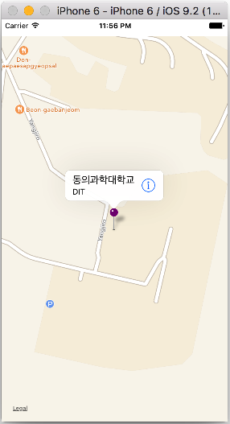
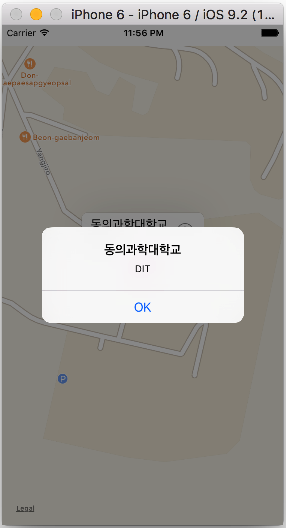
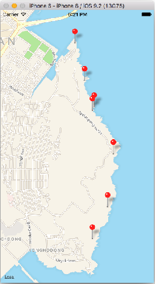
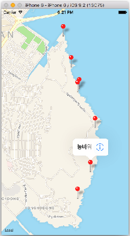
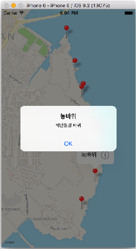
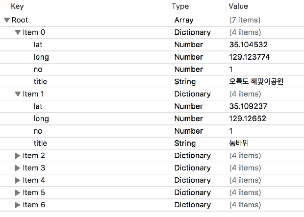
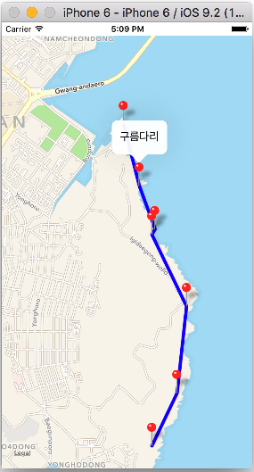
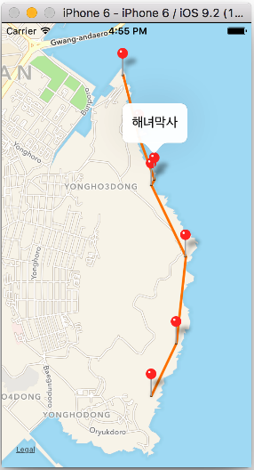

# 07 장

### MapKit, Pin Annotation
 

```Swift
//  ViewController.swift
//  Single Pin Map
import UIKit
import MapKit

class ViewController: UIViewController, MKMapViewDelegate {

    @IBOutlet var myMapView: MKMapView!
    
    override func viewDidLoad() {
        super.viewDidLoad()
        // Do any additional setup after loading the view, typically from a nib.
        //
        //위도,경도:35.1658617,129.07225330000006
        let location = CLLocationCoordinate2DMake(35.1658617, 129.07225330000006)
        let span = MKCoordinateSpanMake(0.004, 0.004)
        let region = MKCoordinateRegionMake(location, span)
        
        myMapView.setRegion(region, animated: true)
        
        // add annotaton
        let annotation = MKPointAnnotation()
        annotation.coordinate = location
        annotation.title = "동의과학대학교"
        annotation.subtitle = "DIT"
        myMapView.addAnnotation(annotation)
        
        myMapView.delegate = self
    }
    
    // MARK: - MKMapViewDelegate function
    func mapView(mapView: MKMapView, viewForAnnotation annotation: MKAnnotation) -> MKAnnotationView? {
        
        var annoView = myMapView.dequeueReusableAnnotationViewWithIdentifier("RE") as? MKPinAnnotationView
        
        if annoView == nil {
            annoView = MKPinAnnotationView(annotation: annotation, reuseIdentifier: "RE")
            annoView!.canShowCallout = true
            annoView!.pinTintColor = UIColor.greenColor()
            
            let btn = UIButton(type: .DetailDisclosure)
            annoView!.rightCalloutAccessoryView = btn
        } else {
            // 6
            annoView!.annotation = annotation
        }
        
//        let annoView = MKPinAnnotationView()
//        annoView.pinTintColor = UIColor.greenColor()
//        annoView.canShowCallout = true
//        let btn = UIButton(type: .DetailDisclosure)
//        annoView.rightCalloutAccessoryView = btn
        
        return annoView
    }
    
    func mapView(mapView: MKMapView, annotationView view: MKAnnotationView, calloutAccessoryControlTapped control: UIControl) {
        
        let viewAnno = view.annotation
        let viewTitle = viewAnno!.title
        let viewSubTitle = viewAnno?.subtitle
        
        let ac = UIAlertController(title: viewTitle!, message: viewSubTitle!, preferredStyle: .Alert)
        ac.addAction(UIAlertAction(title: "OK", style: .Default, handler: nil))
        presentViewController(ac, animated: true, completion: nil)
    }
}
```


### 다중 Pin Annotation
   
```Swift
//  ViewPoint.swift
import MapKit
import UIKit

class ViewPoint: NSObject, MKAnnotation {
	var title: String?
	var coordinate: CLLocationCoordinate2D
	var info: String

	init(title: String, coordinate: CLLocationCoordinate2D, info: String) {
		self.title = title
		self.coordinate = coordinate
		self.info = info
	}
}

////////////////////////////////////////////////
//  ViewController.swift
//  Multi-Pin Annotation
import MapKit
import UIKit

class ViewController: UIViewController {
	@IBOutlet weak var mapView: MKMapView!

	override func viewDidLoad() {
		super.viewDidLoad()
        
        zoomToRegion()

		let a = ViewPoint(title: "오륙도 해맞이공원", coordinate: CLLocationCoordinate2D(latitude: 35.104532, longitude: 129.123774), info: "스카이워크 걷기")
        let b = ViewPoint(title: "농바위", coordinate: CLLocationCoordinate2D(latitude: 35.109237, longitude: 129.12652), info: "해안절경 바위")
        let c = ViewPoint(title: "치마바위", coordinate: CLLocationCoordinate2D(latitude: 35.11696, longitude: 129.12755), info: "해안절경 바위")
        let d = ViewPoint(title: "어울마당", coordinate: CLLocationCoordinate2D(latitude: 35.123349, longitude: 129.123774), info: "광안대교가 멋진곳")
        let e = ViewPoint(title: "해녀막사", coordinate: CLLocationCoordinate2D(latitude: 35.12384, longitude: 129.124117), info: "해산물로 소주한잔")
        let f = ViewPoint(title: "구름다리", coordinate: CLLocationCoordinate2D(latitude: 35.127701, longitude: 129.1224), info: "바닷길 다리 건너기")
        let g = ViewPoint(title: "동생말 전망대", coordinate: CLLocationCoordinate2D(latitude: 35.133176, longitude: 129.120684), info: "광안리, 해운대 보기")

		mapView.addAnnotations([a, b, c, d, e, f, g])  
	}
    
    func zoomToRegion() {
        
        let location = CLLocationCoordinate2D(latitude: 35.118002, longitude: 129.121017)
        let region = MKCoordinateRegionMakeWithDistance(location, 2000.0, 4000.3)
        mapView.setRegion(region, animated: true)
    }


	func mapView(mapView: MKMapView!, viewForAnnotation annotation: MKAnnotation!) -> MKAnnotationView! {
		// 1
		let identifier = "MyViewPoint"

		// 2
		if annotation is ViewPoint {
			// 3
			var annotationView = mapView.dequeueReusableAnnotationViewWithIdentifier(identifier)

			if annotationView == nil {
				//4
				annotationView = MKPinAnnotationView(annotation:annotation, reuseIdentifier:identifier)
				annotationView!.canShowCallout = true

				// 5
				let btn = UIButton(type: .DetailDisclosure)
				annotationView!.rightCalloutAccessoryView = btn
			} else {
				// 6
				annotationView!.annotation = annotation
			}

			return annotationView
		}

		// 7
		return nil
	}

	func mapView(mapView: MKMapView!, annotationView view: MKAnnotationView!, calloutAccessoryControlTapped control: UIControl!) {
		let viewAnno = view.annotation as! ViewPoint
		let placeName = viewAnno.title
		let placeInfo = viewAnno.info

		let ac = UIAlertController(title: placeName, message: placeInfo, preferredStyle: .Alert)
		ac.addAction(UIAlertAction(title: "OK", style: .Default, handler: nil))
		presentViewController(ac, animated: true, completion: nil)
	}
}

```

### pList 화일로 부터 데이터(POI 등) 불러오기



### Overlay로 line 렌더링 하기
 