# 07 장

### MapKit, Pin Annotation

* 참고 학습자료 : http://203.237.244.98/maps.html

 

```Swift
//  ViewController.swift
//  Single Pin Map
import UIKit
import MapKit

class ViewController: UIViewController, MKMapViewDelegate {

    @IBOutlet var myMapView: MKMapView!
    
    override func viewDidLoad() {
        super.viewDidLoad()
        // Do any additional setup after loading the view, typically from a nib.
        //
        //위도,경도:35.1658617,129.07225330000006
        let location = CLLocationCoordinate2DMake(35.1658617, 129.07225330000006)
        let span = MKCoordinateSpanMake(0.004, 0.004)
        let region = MKCoordinateRegionMake(location, span)
        
        myMapView.setRegion(region, animated: true)
        
        // add annotaton
        let annotation = MKPointAnnotation()
        annotation.coordinate = location
        annotation.title = "동의과학대학교"
        annotation.subtitle = "DIT"
        myMapView.addAnnotation(annotation)
        
        myMapView.delegate = self
    }
    
    // MARK: - MKMapViewDelegate function
    // annotation 객체에 대한 View를 반환, pin color, callout 등 pin의 형태를 처리
    func mapView(mapView: MKMapView, viewForAnnotation annotation: MKAnnotation) -> MKAnnotationView? {
        
        var annoView = myMapView.dequeueReusableAnnotationViewWithIdentifier("RE") as? MKPinAnnotationView
        
        if annoView == nil {
            annoView = MKPinAnnotationView(annotation: annotation, reuseIdentifier: "RE")
            annoView!.canShowCallout = true
            annoView!.pinTintColor = UIColor.greenColor()
            
            let btn = UIButton(type: .DetailDisclosure)
            annoView!.rightCalloutAccessoryView = btn
        } else {
            // 6
            annoView!.annotation = annotation
        }
        return annoView
    }
    
    // pin의 callout accessory를 누를때 이벤트 발생
    func mapView(mapView: MKMapView, annotationView view: MKAnnotationView, calloutAccessoryControlTapped control: UIControl) {
        
        let viewAnno = view.annotation
        let viewTitle = viewAnno!.title
        let viewSubTitle = viewAnno?.subtitle
        
        let ac = UIAlertController(title: viewTitle!, message: viewSubTitle!, preferredStyle: .Alert)
        ac.addAction(UIAlertAction(title: "OK", style: .Default, handler: nil))
        presentViewController(ac, animated: true, completion: nil)
    }
}
```

---

#### CalloutAccessary Navigation

 

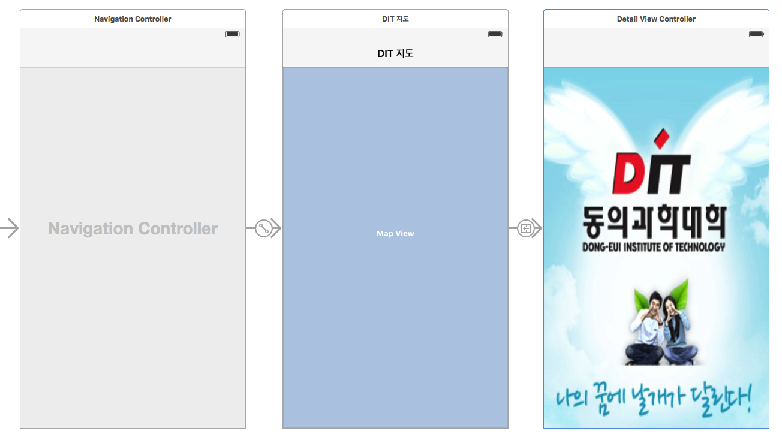
```Swift
//  Callout Accessary를 누르면 DetailView로 전환
    func mapView(mapView: MKMapView, annotationView view: MKAnnotationView, calloutAccessoryControlTapped control: UIControl) {
        
        if(view.tag == 0){
            print(view.tag)
            view.tintColor = UIColor.orangeColor()
        }
        
        if control == view.rightCalloutAccessoryView {
            self.performSegueWithIdentifier("GoDetail", sender: self)
        }
    }
```

### 다중 Pin Annotation
   
```Swift
//  ViewPoint.swift
import MapKit
import UIKit

class ViewPoint: NSObject, MKAnnotation {
	var title: String?
	var coordinate: CLLocationCoordinate2D
	var info: String

	init(title: String, coordinate: CLLocationCoordinate2D, info: String) {
		self.title = title
		self.coordinate = coordinate
		self.info = info
	}
}

////////////////////////////////////////////////
//  ViewController.swift
//  Multi-Pin Annotation
import MapKit
import UIKit

class ViewController: UIViewController {
	@IBOutlet weak var mapView: MKMapView!

	override func viewDidLoad() {
		super.viewDidLoad()
        
        // 지도의 location, region, Map 설정
        zoomToRegion()

		let a = ViewPoint(title: "오륙도 해맞이공원", coordinate: CLLocationCoordinate2D(latitude: 35.104532, longitude: 129.123774), info: "스카이워크 걷기")
        let b = ViewPoint(title: "농바위", coordinate: CLLocationCoordinate2D(latitude: 35.109237, longitude: 129.12652), info: "해안절경 바위")
        let c = ViewPoint(title: "치마바위", coordinate: CLLocationCoordinate2D(latitude: 35.11696, longitude: 129.12755), info: "해안절경 바위")
        let d = ViewPoint(title: "어울마당", coordinate: CLLocationCoordinate2D(latitude: 35.123349, longitude: 129.123774), info: "광안대교가 멋진곳")
        let e = ViewPoint(title: "해녀막사", coordinate: CLLocationCoordinate2D(latitude: 35.12384, longitude: 129.124117), info: "해산물로 소주한잔")
        let f = ViewPoint(title: "구름다리", coordinate: CLLocationCoordinate2D(latitude: 35.127701, longitude: 129.1224), info: "바닷길 다리 건너기")
        let g = ViewPoint(title: "동생말 전망대", coordinate: CLLocationCoordinate2D(latitude: 35.133176, longitude: 129.120684), info: "광안리, 해운대 보기")

		mapView.addAnnotations([a, b, c, d, e, f, g])  
	}
    
    func zoomToRegion() {
        
        let location = CLLocationCoordinate2D(latitude: 35.118002, longitude: 129.121017)
        let region = MKCoordinateRegionMakeWithDistance(location, 2000.0, 4000.3)
        mapView.setRegion(region, animated: true)
    }
    
    // annotation View 설정, pin color, callout accessary 등
	func mapView(mapView: MKMapView!, viewForAnnotation annotation: MKAnnotation!) -> MKAnnotationView! {
		// 1
		let identifier = "MyViewPoint"

		// 2
		if annotation is ViewPoint {
			// 3
			var annotationView = mapView.dequeueReusableAnnotationViewWithIdentifier(identifier)

			if annotationView == nil {
				//4
				annotationView = MKPinAnnotationView(annotation:annotation, reuseIdentifier:identifier)
				annotationView!.canShowCallout = true

				// 5
				let btn = UIButton(type: .DetailDisclosure)
				annotationView!.rightCalloutAccessoryView = btn
			} else {
				// 6
				annotationView!.annotation = annotation
			}

			return annotationView
		}

		// 7
		return nil
	}

    // callout accessary를 눌렀을때 alert View 보여줌
	func mapView(mapView: MKMapView!, annotationView view: MKAnnotationView!, calloutAccessoryControlTapped control: UIControl!) {
		let viewAnno = view.annotation as! ViewPoint
		let placeName = viewAnno.title
		let placeInfo = viewAnno.info

		let ac = UIAlertController(title: placeName, message: placeInfo, preferredStyle: .Alert)
		ac.addAction(UIAlertAction(title: "OK", style: .Default, handler: nil))
		presentViewController(ac, animated: true, completion: nil)
	}
}

```

### plist 화일로 부터 데이터(POI 등) 불러오기

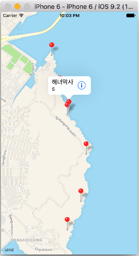 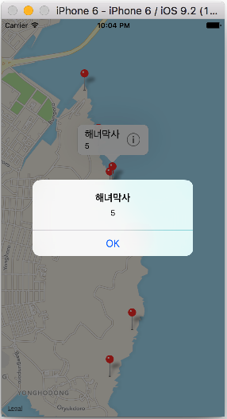

```Swift
//  ViewController.swift
//  Multi-Pin Annotation
//  viewpoint.plist 사용

import MapKit
import UIKit

class ViewController: UIViewController {
	@IBOutlet weak var mapView: MKMapView!

	override func viewDidLoad() {
		super.viewDidLoad()
        
        zoomToRegion()
        
        // pin의 empty 배열, mutable하게 객체 추가
        var annotations:Array = [ViewPoint]()
        
        // plist 화일 저장
        var viewpoints: NSArray?

        // viewpoint.plist load
        if let path = NSBundle.mainBundle().pathForResource("viewpoint", ofType: "plist") {
            print("path= \(path)")
            viewpoints = NSArray(contentsOfFile: path)!
            print("array = \(viewpoints)")
        }
        
        if let items = viewpoints {
            for item in items {  // optional binding
                let long = item.valueForKey("long") as! Double
                let lat = item.valueForKey("lat") as! Double
                let title = item.valueForKey("title") as! String
                let subtitle = item.valueForKey("subtitle") as! String
                //print(title)
            
                let annotation = ViewPoint(title: "title", coordinate: CLLocationCoordinate2D(latitude: lat, longitude: long), subtitle: "subtitle")
            
                annotation.title = title
                annotation.subtitle = subtitle
                annotations.append(annotation)
            }
        }
        
        mapView.showAnnotations(annotations, animated: true)
        mapView.addAnnotations(annotations)
        
        /*
		let a = ViewPoint(title: "오륙도 해맞이공원", coordinate: CLLocationCoordinate2D(latitude: 35.104532, longitude: 129.123774), info: "스카이워크 걷기")
        let b = ViewPoint(title: "농바위", coordinate: CLLocationCoordinate2D(latitude: 35.109237, longitude: 129.12652), info: "해안절경 바위")
        let c = ViewPoint(title: "치마바위", coordinate: CLLocationCoordinate2D(latitude: 35.11696, longitude: 129.12755), info: "해안절경 바위")
        let d = ViewPoint(title: "어울마당", coordinate: CLLocationCoordinate2D(latitude: 35.123349, longitude: 129.123774), info: "광안대교가 멋진곳")
        let e = ViewPoint(title: "해녀막사", coordinate: CLLocationCoordinate2D(latitude: 35.12384, longitude: 129.124117), info: "해산물로 소주한잔")
        let f = ViewPoint(title: "구름다리", coordinate: CLLocationCoordinate2D(latitude: 35.127701, longitude: 129.1224), info: "바닷길 다리 건너기")
        let g = ViewPoint(title: "동생말 전망대", coordinate: CLLocationCoordinate2D(latitude: 35.133176, longitude: 129.120684), info: "광안리, 해운대 보기")

        let myPoint = [a, b, c, d, e, f, g]
        */

		//mapView.addAnnotations([a, b, c, d, e, f, g])
        //mapView.showAnnotations(myPoint, animated: true)
        //mapView.selectAnnotation(e, animated: true)  
	}
    
    // 초기 맵 region 설정
    func zoomToRegion() {
        
        let location = CLLocationCoordinate2D(latitude: 35.118002, longitude: 129.121017)
        let region = MKCoordinateRegionMakeWithDistance(location, 2000.0, 4000.3)
        mapView.setRegion(region, animated: true)
    }


	func mapView(mapView: MKMapView!, viewForAnnotation annotation: MKAnnotation!) -> MKAnnotationView! {
		// 1
		let identifier = "MyPin"
        
        // 사용자의 현재 위치 annotation을 제외함
        if annotation.isKindOfClass(MKUserLocation) {
            return nil
        }

		// 2
		if annotation .isKindOfClass(ViewPoint) {
            // if annotation is ViewPoint
			// 3
			var annotationView = mapView.dequeueReusableAnnotationViewWithIdentifier(identifier)

			if annotationView == nil {
				//4
				annotationView = MKPinAnnotationView(annotation:annotation, reuseIdentifier:identifier)
				annotationView!.canShowCallout = true

//				// 5
//				let btn = UIButton(type: .DetailDisclosure)
//				annotationView!.rightCalloutAccessoryView = btn
			} else {
				// 6
				annotationView!.annotation = annotation
			}
            
            // 5
            let btn = UIButton(type: .DetailDisclosure)
            annotationView!.rightCalloutAccessoryView = btn
			
            return annotationView
		}
		// 7
		return nil
	}

	func mapView(mapView: MKMapView!, annotationView view: MKAnnotationView!, calloutAccessoryControlTapped control: UIControl!) {
		
        let viewAnno = view.annotation as! ViewPoint // MKAnnotation
		let placeName = viewAnno.title
		let placeInfo = viewAnno.subtitle

		let ac = UIAlertController(title: placeName, message: placeInfo, preferredStyle: .Alert)
		ac.addAction(UIAlertAction(title: "OK", style: .Default, handler: nil))
		presentViewController(ac, animated: true, completion: nil)
	}
}
```
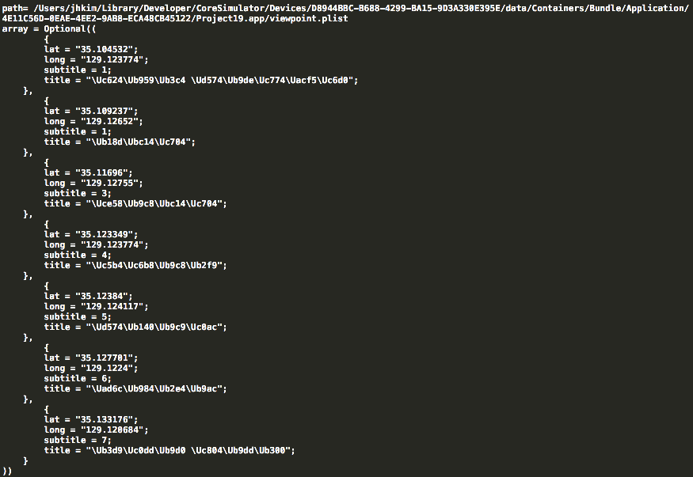

### Geocoding
* 
참고 학습자료 :
http://mhorga.org/2015/08/14/geocoding-in-ios.html

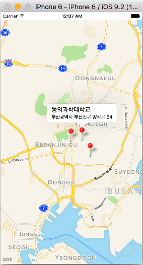 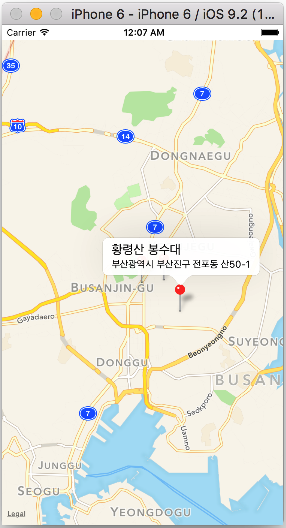 


#### `address.plist`


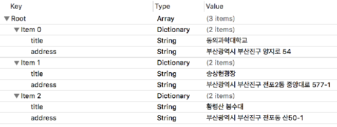

```Swift
//  ViewController.swift
//  pList, Geocoding, Pin annotation

import UIKit
import MapKit

class ViewController: UIViewController {

    @IBOutlet var mapView: MKMapView!
    
    override func viewDidLoad() {
        super.viewDidLoad()
        // Do any additional setup after loading the view, typically from a nib.
        
        
        // 지도 center, span 집기
        zoomToRegion()
        
        //1. pList 파일의 path
        let path = NSBundle.mainBundle().pathForResource("address", ofType: "plist")
        print("path = \(path)")
        
        let contents = NSArray(contentsOfFile: path!)
        
        // annotation 객체를 저장할 empty 배열
        var annotations = [MKPointAnnotation]()
        
        // optional binding... contents가 nil이 아니면 for 실행
        if let myItems = contents {
            for item in myItems {
                // Plist 화일의 dictionary의 value을 key로 뽑음
                let title = item.valueForKey("title") as! String
                let address = item.valueForKey("address") as! String
                
                // reverse-Geocoding : 주소를 coordinate(위도, 경도)로 변환하고 맵에 annotation 꼽기
                // Geocoding 객체 생성
                let geoCoder = CLGeocoder()
                
                // address를 coordinate로 변환함
                geoCoder.geocodeAddressString(address, completionHandler: { placemarks, error in
                    
                    if error != nil {
                        print(error)
                        return
                    }
                    
                    if let placemarks = placemarks {
                        // Get the first placemark
                        let placemark = placemarks[0]
                        
                        // Add annotation
                        let annotation = MKPointAnnotation()
                        annotation.title = title
                        annotation.subtitle = address
                        
                        if let location = placemark.location {
                            annotation.coordinate = location.coordinate
                            annotations.append(annotation)
                            // Display the annotation
                            //self.mapView.addAnnotation(annotation)
                            
//                            if annotation.title == "동의과학대학교" {
//                                self.mapView.selectAnnotation(annotation, animated: true)
//                            }
                        }
                        
                        print(annotations[0].coordinate)
                        self.mapView.addAnnotations(annotations)
                    }
                   
                })
            }
        }
        
//        if let myItems = contents {
//            for item in myItems {
//                let lat = item.valueForKey("long") as! Double
//                let long = item.valueForKey("lat") as! Double
//                let title = item.valueForKey("title") as! String
//                
//                let annotation = MKPointAnnotation()
//                annotation.coordinate.longitude = long
//                annotation.coordinate.latitude = lat
//                annotation.title = title
//                
//                annotations.append(annotation)
//                //mapView.addAnnotation(annotation)
//            }
//            
//            mapView.addAnnotations(annotations)
//        }
    }
    
    func zoomToRegion() {
        
        // 양정 송상현광장 35.164472, 129.064898
        let location = CLLocationCoordinate2D(latitude: 35.164472, longitude: 129.064898)
        let region = MKCoordinateRegionMakeWithDistance(location, 10000.0, 10000.0)
 
        // 이기대
//        let location = CLLocationCoordinate2D(latitude: 35.118002, longitude: 129.121017)
//        let region = MKCoordinateRegionMakeWithDistance(location, 2000.0, 4000.3)
        mapView.setRegion(region, animated: true)
    }

    override func didReceiveMemoryWarning() {
        super.didReceiveMemoryWarning()
        // Dispose of any resources that can be recreated.
    }
}
```

#####[소스 코드 다운로드](https://dl.dropboxusercontent.com/u/11130733/Lec_2016_public/Geocoding_plist_annotation.zip)

### Overlay로 line 렌더링 하기

* 
참고 학습자료 :
http://blog.robkerr.com/adding-a-mkpolyline-overlay-using-swift-to-an-ios-mapkit-map/

 

```Swift
//  ViewController.swift
//  Multi-Pin Annotation & Over Line Rendering

import MapKit
import UIKit

class ViewController: UIViewController {
	@IBOutlet weak var mapView: MKMapView!

	override func viewDidLoad() {
		super.viewDidLoad()
        
        zoomToRegion()

		let a = ViewPoint(title: "오륙도 해맞이공원", coordinate: CLLocationCoordinate2D(latitude: 35.104532, longitude: 129.123774), info: "스카이워크 걷기")
        let b = ViewPoint(title: "농바위", coordinate: CLLocationCoordinate2D(latitude: 35.109237, longitude: 129.12652), info: "해안절경 바위")
        let c = ViewPoint(title: "치마바위", coordinate: CLLocationCoordinate2D(latitude: 35.11696, longitude: 129.12755), info: "해안절경 바위")
        let d = ViewPoint(title: "어울마당", coordinate: CLLocationCoordinate2D(latitude: 35.123349, longitude: 129.123774), info: "광안대교가 멋진곳")
        let e = ViewPoint(title: "해녀막사", coordinate: CLLocationCoordinate2D(latitude: 35.12384, longitude: 129.124117), info: "해산물로 소주한잔")
        let f = ViewPoint(title: "구름다리", coordinate: CLLocationCoordinate2D(latitude: 35.127701, longitude: 129.1224), info: "바닷길 다리 건너기")
        let g = ViewPoint(title: "동생말 전망대", coordinate: CLLocationCoordinate2D(latitude: 35.133176, longitude: 129.120684), info: "광안리, 해운대 보기")
        
        let myPoint = [a, b, c, d, e, f, g]
        
        var myCoordinate = [a.coordinate, b.coordinate, c.coordinate, d.coordinate, e.coordinate,
                            f.coordinate, g.coordinate]

		//mapView.addAnnotations([a, b, c, d, e, f, g])
        mapView.showAnnotations(myPoint, animated: true)
        mapView.selectAnnotation(e, animated: true)
        
        //////
        let polyline = MKPolyline(coordinates: &myCoordinate, count: myCoordinate.count)
        mapView.addOverlay(polyline)
	}
 
    func zoomToRegion() {

        let location = CLLocationCoordinate2D(latitude: 35.118002, longitude: 129.121017)
        let region = MKCoordinateRegionMakeWithDistance(location, 2000.0, 4000.3)
        mapView.setRegion(region, animated: true)
    }


	func mapView(mapView: MKMapView!, viewForAnnotation annotation: MKAnnotation!) -> MKAnnotationView! {
		// 1
		let identifier = "MyPin"
        
        // 사용자의 현재 위치 annotation을 제외함
        if annotation.isKindOfClass(MKUserLocation) {
            return nil
        }

		// 2
		if annotation .isKindOfClass(ViewPoint) {
            // if annotation is ViewPoint
			// 3
			var annotationView = mapView.dequeueReusableAnnotationViewWithIdentifier(identifier)

			if annotationView == nil {
				//4
				annotationView = MKPinAnnotationView(annotation:annotation, reuseIdentifier:identifier)
				annotationView!.canShowCallout = true

//				// 5
//				let btn = UIButton(type: .DetailDisclosure)
//				annotationView!.rightCalloutAccessoryView = btn
			} else {
				// 6
				annotationView!.annotation = annotation
			}
            
            // 5
            let btn = UIButton(type: .DetailDisclosure)
            annotationView!.rightCalloutAccessoryView = btn
			
            return annotationView
		}

		// 7
		return nil
	}

	func mapView(mapView: MKMapView!, annotationView view: MKAnnotationView!, calloutAccessoryControlTapped control: UIControl!) {
		
        let viewAnno = view.annotation as! ViewPoint // MKAnnotation
		let placeName = viewAnno.title
		let placeInfo = viewAnno.info

		let ac = UIAlertController(title: placeName, message: placeInfo, preferredStyle: .Alert)
		ac.addAction(UIAlertAction(title: "OK", style: .Default, handler: nil))
		presentViewController(ac, animated: true, completion: nil)
	}
    
    func mapView(mapView: MKMapView!, viewForOverlay overlay: MKOverlay!) -> MKOverlayRenderer! {
        
        if (overlay is MKPolyline) {
            let pr = MKPolylineRenderer(overlay: overlay);
            pr.strokeColor = UIColor.orangeColor().colorWithAlphaComponent(0.5);
            pr.lineWidth = 5;
            return pr;
        }
        
        return nil
    }
}
```


### CoreLocation
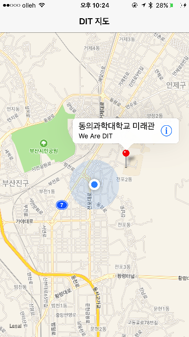

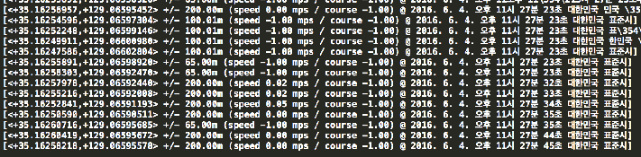

* 
`NSLocationAlwaysUsageDescription` (항상 허용)
* 
`NSLocationWhenInUseUsageDescription` (사용중인 경우만 허용)
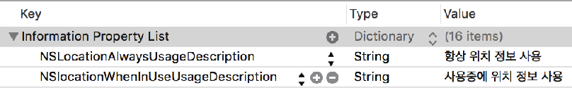

``` Swift
//  ViewController.swift
//  Simple CoreLocation Test
import UIKit
import MapKit
import CoreLocation

class ViewController: UIViewController, CLLocationManagerDelegate {

    @IBOutlet var myMapView: MKMapView!
    var locationManager = CLLocationManager()
    
    override func viewDidLoad() {
        super.viewDidLoad()
        // Do any additional setup after loading the view, typically from
        locationManager.delegate = self
        locationManager.startUpdatingLocation()
        locationManager.requestWhenInUseAuthorization()
        locationManager.startUpdatingLocation()
        locationManager.requestAlwaysAuthorization()
        
        myMapView.showsUserLocation = true  
    }
    
    func locationManager(manager: CLLocationManager, didUpdateLocations locations: [CLLocation]) {
        let userLocation: CLLocation = locations[0]
        print(userLocation)
        
        let center = CLLocationCoordinate2D(latitude: userLocation.coordinate.latitude, longitude: userLocation.coordinate.longitude)
        let region = MKCoordinateRegion(center: center, span: MKCoordinateSpan(latitudeDelta: 0.03, longitudeDelta: 0.03))
        
        myMapView.setRegion(region, animated: true)
        
        ////
        let annotation = MKPointAnnotation()
        annotation.coordinate = center
        annotation.title = "동의과학대학교 미래관"
        annotation.subtitle = "We Are DIT"
        
        myMapView.addAnnotation(annotation)
        myMapView.selectAnnotation(annotation, animated: true)
    }

    override func didReceiveMemoryWarning() {
        super.didReceiveMemoryWarning()
        // Dispose of any resources that can be recreated.
    }
}
```

---

### Location Tracking : Corelocation, overlay line rendering

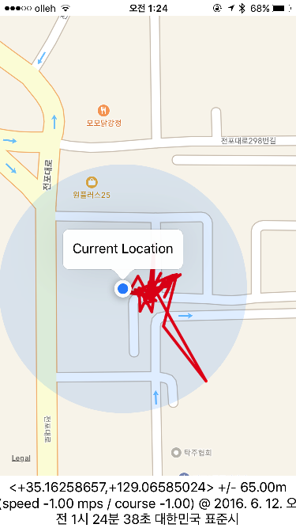 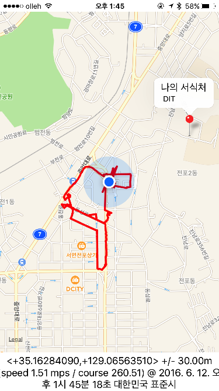 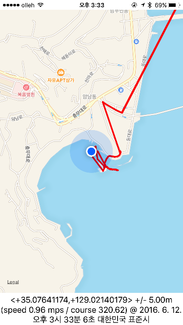
```Swift
//  ViewController.swift
//  Location Tracker

import UIKit
import MapKit
import CoreLocation

class ViewController: UIViewController, CLLocationManagerDelegate, MKMapViewDelegate  {
    @IBOutlet var mapView: MKMapView!
    @IBOutlet var outLabel: UILabel!
    
    var manager: CLLocationManager!
    var myLocations: [CLLocation] = []

    override func viewDidLoad() {
        super.viewDidLoad()
        // Do any additional setup after loading the view, typically from a nib.
        
        // setup location manager
        manager = CLLocationManager()
        manager.delegate = self
        
        manager.desiredAccuracy = kCLLocationAccuracyBest
        manager.requestAlwaysAuthorization()
        manager.startUpdatingLocation()
        
        // setup MapView
        mapView.delegate = self
        //mapView.mapType = MKMapType.Hybrid
        mapView.showsUserLocation = true
        
        locateAndAddPin()  
    }
    
    func locationManager(manager: CLLocationManager, didUpdateLocations locations: [CLLocation]) {
        outLabel.text = "\(locations[0])"
        myLocations.append(locations[0])
        
        let newRegion = MKCoordinateRegion(center: mapView.userLocation.coordinate, span: MKCoordinateSpanMake(0.015, 0.015))
        
        mapView.setRegion(newRegion, animated: true)
        
        if myLocations.count > 1 {
            let sourceIndex = myLocations.count - 1
            let destinationIndex = myLocations.count - 2
            let c1 = myLocations[sourceIndex].coordinate
            let c2 = myLocations[destinationIndex].coordinate
            
            print("MyLocations's count = \(myLocations.count)")
            print("source Index = \(sourceIndex)")
            print("dest Index = \(destinationIndex)")
            
            var a = [c1, c2]
            let polyline = MKPolyline(coordinates: &a, count: a.count)
            
            mapView.addOverlay(polyline)
        }
    }
    
    func mapView(mapView: MKMapView, rendererForOverlay overlay: MKOverlay) -> MKOverlayRenderer {
        
            let polylineRenderer = MKPolylineRenderer(overlay: overlay)
            polylineRenderer.strokeColor = UIColor.redColor()
            polylineRenderer.lineWidth = 3
            return polylineRenderer
    }
    
//    func mapView(mapView: MKMapView, rendererForOverlay overlay: MKOverlay) -> MKOverlayRenderer {
//        let pr = MKPolylineRenderer(overlay: overlay)
//        pr.strokeColor = self.lightBlue
//        pr.lineWidth = 14
//        return pr
//    }
    
    func locateAndAddPin() {
        // 동의과학대학교 35.165500, 129.071274
        // 위도, 경도 설정
        let center: CLLocationCoordinate2D = CLLocationCoordinate2DMake(35.165500, 129.071274)
        // 보여주는 범위 설정
        let span = MKCoordinateSpanMake(0.015, 0.015)
        // 보여주는 region 설정
        let region = MKCoordinateRegionMake(center, span)
        mapView.setRegion(region, animated: true)
        
        ////// annotation 꼽기
        let annotation = MKPointAnnotation()
        annotation.coordinate = center
        annotation.title = "나의 서식처"
        annotation.subtitle = " DIT"
        mapView.addAnnotation(annotation)
        mapView.selectAnnotation(annotation, animated: true)
    }

    override func didReceiveMemoryWarning() {
        super.didReceiveMemoryWarning()
        // Dispose of any resources that can be recreated.
    }
}
```


---


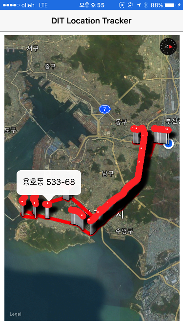 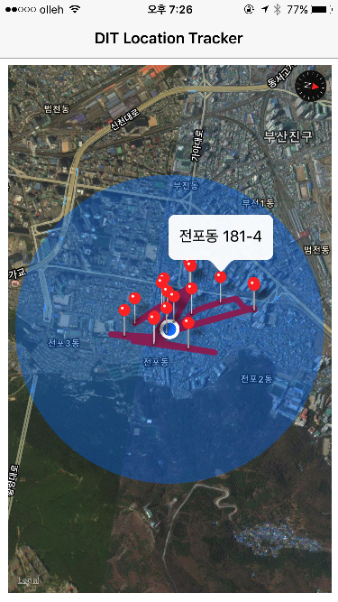

#### 참고 학습자료 : current location tracking & overlay line rendering

http://www.johnmullins.co/blog/2014/08/14/location-tracker-with-maps/
