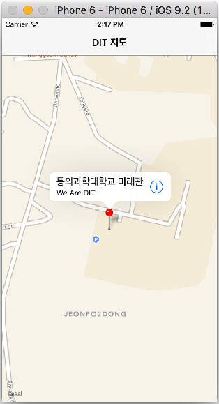

# 07 장

### MapKit, Pin Annotation

* 참고 학습자료 : http://203.237.244.98/maps.html

 

```Swift
//  ViewController.swift
//  Single Pin Map
import UIKit
import MapKit

class ViewController: UIViewController, MKMapViewDelegate {

    @IBOutlet var myMapView: MKMapView!
    
    override func viewDidLoad() {
        super.viewDidLoad()
        // Do any additional setup after loading the view, typically from a nib.
        //
        //위도,경도:35.1658617,129.07225330000006
        let location = CLLocationCoordinate2DMake(35.1658617, 129.07225330000006)
        let span = MKCoordinateSpanMake(0.004, 0.004)
        let region = MKCoordinateRegionMake(location, span)
        
        myMapView.setRegion(region, animated: true)
        
        // add annotaton
        let annotation = MKPointAnnotation()
        annotation.coordinate = location
        annotation.title = "동의과학대학교"
        annotation.subtitle = "DIT"
        myMapView.addAnnotation(annotation)
        
        myMapView.delegate = self
    }
    
    // MARK: - MKMapViewDelegate function
    // annotation 객체에 대한 View를 반환, pin color, callout 등 pin의 형태를 처리
    func mapView(mapView: MKMapView, viewForAnnotation annotation: MKAnnotation) -> MKAnnotationView? {
        
        var annoView = myMapView.dequeueReusableAnnotationViewWithIdentifier("RE") as? MKPinAnnotationView
        
        if annoView == nil {
            annoView = MKPinAnnotationView(annotation: annotation, reuseIdentifier: "RE")
            annoView!.canShowCallout = true
            annoView!.pinTintColor = UIColor.greenColor()
            
            let btn = UIButton(type: .DetailDisclosure)
            annoView!.rightCalloutAccessoryView = btn
        } else {
            // 6
            annoView!.annotation = annotation
        }
        return annoView
    }
    
    // pin의 callout accessory를 누를때 이벤트 발생
    func mapView(mapView: MKMapView, annotationView view: MKAnnotationView, calloutAccessoryControlTapped control: UIControl) {
        
        let viewAnno = view.annotation
        let viewTitle = viewAnno!.title
        let viewSubTitle = viewAnno?.subtitle
        
        let ac = UIAlertController(title: viewTitle!, message: viewSubTitle!, preferredStyle: .Alert)
        ac.addAction(UIAlertAction(title: "OK", style: .Default, handler: nil))
        presentViewController(ac, animated: true, completion: nil)
    }
}
```

---
 


```Swift
//  Callout Accessary를 누르면 DetailView로 전환
    func mapView(mapView: MKMapView, annotationView view: MKAnnotationView, calloutAccessoryControlTapped control: UIControl) {
        
        if(view.tag == 0){
            print(view.tag)
            view.tintColor = UIColor.orangeColor()
        }
        
        if control == view.rightCalloutAccessoryView {
            self.performSegueWithIdentifier("GoDetail", sender: self)
        }
    }
```

### 다중 Pin Annotation
   
```Swift
//  ViewPoint.swift
import MapKit
import UIKit

class ViewPoint: NSObject, MKAnnotation {
	var title: String?
	var coordinate: CLLocationCoordinate2D
	var info: String

	init(title: String, coordinate: CLLocationCoordinate2D, info: String) {
		self.title = title
		self.coordinate = coordinate
		self.info = info
	}
}

////////////////////////////////////////////////
//  ViewController.swift
//  Multi-Pin Annotation
import MapKit
import UIKit

class ViewController: UIViewController {
	@IBOutlet weak var mapView: MKMapView!

	override func viewDidLoad() {
		super.viewDidLoad()
        
        // 지도의 location, region, Map 설정
        zoomToRegion()

		let a = ViewPoint(title: "오륙도 해맞이공원", coordinate: CLLocationCoordinate2D(latitude: 35.104532, longitude: 129.123774), info: "스카이워크 걷기")
        let b = ViewPoint(title: "농바위", coordinate: CLLocationCoordinate2D(latitude: 35.109237, longitude: 129.12652), info: "해안절경 바위")
        let c = ViewPoint(title: "치마바위", coordinate: CLLocationCoordinate2D(latitude: 35.11696, longitude: 129.12755), info: "해안절경 바위")
        let d = ViewPoint(title: "어울마당", coordinate: CLLocationCoordinate2D(latitude: 35.123349, longitude: 129.123774), info: "광안대교가 멋진곳")
        let e = ViewPoint(title: "해녀막사", coordinate: CLLocationCoordinate2D(latitude: 35.12384, longitude: 129.124117), info: "해산물로 소주한잔")
        let f = ViewPoint(title: "구름다리", coordinate: CLLocationCoordinate2D(latitude: 35.127701, longitude: 129.1224), info: "바닷길 다리 건너기")
        let g = ViewPoint(title: "동생말 전망대", coordinate: CLLocationCoordinate2D(latitude: 35.133176, longitude: 129.120684), info: "광안리, 해운대 보기")

		mapView.addAnnotations([a, b, c, d, e, f, g])  
	}
    
    func zoomToRegion() {
        
        let location = CLLocationCoordinate2D(latitude: 35.118002, longitude: 129.121017)
        let region = MKCoordinateRegionMakeWithDistance(location, 2000.0, 4000.3)
        mapView.setRegion(region, animated: true)
    }
    
    // annotation View 설정, pin color, callout accessary 등
	func mapView(mapView: MKMapView!, viewForAnnotation annotation: MKAnnotation!) -> MKAnnotationView! {
		// 1
		let identifier = "MyViewPoint"

		// 2
		if annotation is ViewPoint {
			// 3
			var annotationView = mapView.dequeueReusableAnnotationViewWithIdentifier(identifier)

			if annotationView == nil {
				//4
				annotationView = MKPinAnnotationView(annotation:annotation, reuseIdentifier:identifier)
				annotationView!.canShowCallout = true

				// 5
				let btn = UIButton(type: .DetailDisclosure)
				annotationView!.rightCalloutAccessoryView = btn
			} else {
				// 6
				annotationView!.annotation = annotation
			}

			return annotationView
		}

		// 7
		return nil
	}

    // callout accessary를 눌렀을때 alert View 보여줌
	func mapView(mapView: MKMapView!, annotationView view: MKAnnotationView!, calloutAccessoryControlTapped control: UIControl!) {
		let viewAnno = view.annotation as! ViewPoint
		let placeName = viewAnno.title
		let placeInfo = viewAnno.info

		let ac = UIAlertController(title: placeName, message: placeInfo, preferredStyle: .Alert)
		ac.addAction(UIAlertAction(title: "OK", style: .Default, handler: nil))
		presentViewController(ac, animated: true, completion: nil)
	}
}

```

### pList 화일로 부터 데이터(POI 등) 불러오기


### Overlay로 line 렌더링 하기

####참고 학습자료
http://blog.robkerr.com/adding-a-mkpolyline-overlay-using-swift-to-an-ios-mapkit-map/

 

### CoreLocation


* 
NSLocationAlwaysUsageDescription (항상 허용)
* 
NSLocationWhenInUseUsageDescription (사용중인 경우만 허용)


``` Swift
//  ViewController.swift
//  Simple CoreLocation Test
import UIKit
import MapKit
import CoreLocation

class ViewController: UIViewController, CLLocationManagerDelegate {

    @IBOutlet var myMapView: MKMapView!
    
    var locationManager = CLLocationManager()
    
    override func viewDidLoad() {
        super.viewDidLoad()
        // Do any additional setup after loading the view, typically from
        locationManager.delegate = self
        locationManager.startUpdatingLocation()
        locationManager.requestWhenInUseAuthorization()
        locationManager.startUpdatingLocation()
        locationManager.requestAlwaysAuthorization()
        
        myMapView.showsUserLocation = true
        
    }
    
    func locationManager(manager: CLLocationManager, didUpdateLocations locations: [CLLocation]) {
        let userLocation: CLLocation = locations[0]
        print(userLocation)
        
        let center = CLLocationCoordinate2D(latitude: userLocation.coordinate.latitude, longitude: userLocation.coordinate.longitude)
        let region = MKCoordinateRegion(center: center, span: MKCoordinateSpan(latitudeDelta: 0.03, longitudeDelta: 0.03))
        
        myMapView.setRegion(region, animated: true)
        
        ////
        let annotation = MKPointAnnotation()
        annotation.coordinate = center
        annotation.title = "동의과학대학교 미래관"
        annotation.subtitle = "We Are DIT"
        
        myMapView.addAnnotation(annotation)
        myMapView.selectAnnotation(annotation, animated: true)
    }

    override func didReceiveMemoryWarning() {
        super.didReceiveMemoryWarning()
        // Dispose of any resources that can be recreated.
    }
}
```


---


```Swift
//  ViewController.swift
//  CoreLocation/ Location Tracking

import UIKit
import MapKit
import CoreLocation

class ViewController: UIViewController, MKMapViewDelegate, CLLocationManagerDelegate {

    @IBOutlet var myMapView: MKMapView!
//    let myLocationManager = CLLocationManager()
    var myLocationManager: CLLocationManager?
    
    override func viewDidLoad() {
        super.viewDidLoad()
        // Do any additional setup after loading the view, typically from a nib.
        
        // 현재 폰사용자의 위치를 보여줌
        myMapView.showsUserLocation = true
        
        myMapView.delegate = self
        // 우리학교 미래관 35.164987, 129.071425
        let location = CLLocationCoordinate2DMake(35.164987, 129.071425)
        // 반경
        let span = MKCoordinateSpanMake(0.005, 0.005)
        // 보여줄 region 만듬
        let region = MKCoordinateRegionMake(location, span)
        // Map에 add
        myMapView.setRegion(region, animated: true)
        
        // annotation Pin 꼽기
        let pin = MKPointAnnotation()
        
        pin.coordinate = location
        pin.title = "동의과학대학교 미래관"
        pin.subtitle = "We Are DIT"
        
        myMapView.addAnnotation(pin)
        myMapView.selectAnnotation(pin, animated: true)
        
        // 위치 트랙킹 설정
        initLocationManager()
        
    }
    
    // MARK: - MKMapViewDelegate function
    // Returns the view associated with the specified annotation object.
    func mapView(mapView: MKMapView, viewForAnnotation annotation: MKAnnotation) -> MKAnnotationView? {
        
        // 사용자의 현재 위치 annotation을 제외함
        if annotation.isKindOfClass(MKUserLocation) {
            return nil
        }
        
        var pinView = myMapView.dequeueReusableAnnotationViewWithIdentifier("RE") as? MKPinAnnotationView
        
        if pinView == nil {
            pinView = MKPinAnnotationView(annotation: annotation, reuseIdentifier: "RE")
            pinView!.canShowCallout = true
            pinView!.pinTintColor = UIColor.redColor()
            
            let btn = UIButton(type: .DetailDisclosure)
            pinView!.rightCalloutAccessoryView = btn
        } else {
            // 6
            pinView!.annotation = annotation
        }
        return pinView
    }
    
//  Callout Accessary를 누르면 DetailView로 전환
    func mapView(mapView: MKMapView, annotationView view: MKAnnotationView, calloutAccessoryControlTapped control: UIControl) {
        
        if(view.tag == 0){
            print(view.tag)
            view.tintColor = UIColor.orangeColor()
        }
        
        if control == view.rightCalloutAccessoryView {
            self.performSegueWithIdentifier("GoDetail", sender: self)
        }
    }
    
//    func mapView(mapView: MKMapView, annotationView view: MKAnnotationView, calloutAccessoryControlTapped control: UIControl) {
//        
//        let viewPin = view.annotation
//        let viewTitle = viewPin!.title
//        let viewSubTitle = viewPin?.subtitle
//        
//        let ac = UIAlertController(title: viewTitle!, message: viewSubTitle!, preferredStyle: .Alert)
//        ac.addAction(UIAlertAction(title: "OK", style: .Default, handler: nil))
//        presentViewController(ac, animated: true, completion: nil)
//    }
    
    func initLocationManager() {
        myLocationManager = CLLocationManager()
        myLocationManager!.delegate = self
        myLocationManager!.desiredAccuracy = kCLLocationAccuracyBest
        myLocationManager!.requestAlwaysAuthorization()
        myLocationManager!.startUpdatingLocation()
        
     }
    
//    func mapView(mapView: MKMapView, didAddAnnotationViews views: [MKAnnotationView]) {
//        views.forEach() {
//            view in if view.annotation is MKUserLocation {
//                myMapView.selectAnnotation(view.annotation!, animated: true)
//            }
//        }
//    }
    
//    func locationManager(manager: CLLocationManager, didUpdateLocations locations: [CLLocation]) {
//        let locationArray = locations as NSArray
//        let locationObj = locationArray.lastObject as! CLLocation
//        let coord = locationObj.coordinate
//        
//        print(coord.latitude)
//        print(coord.longitude)
//    }
    
    // 현재 위치 트랙킹 및 지도에 표시
    func locationManager(manager: CLLocationManager, didUpdateLocations locations: [CLLocation]) {
        print(locations)
        let location = locations.last
        
        let center = CLLocationCoordinate2D(latitude: location!.coordinate.latitude, longitude: location!.coordinate.longitude)
        let region = MKCoordinateRegion(center: center, span: MKCoordinateSpan(latitudeDelta: 0.03, longitudeDelta: 0.03))
        
        myMapView.setRegion(region, animated: true)
    }
    
    
    func locationManager(manager: CLLocationManager, didFailWithError error: NSError) {
        print("Error while updating location " + error.localizedDescription)
    }
    
//    func locationManager(manager: CLLocationManager,
//        didChangeAuthorizationStatus status: CLAuthorizationStatus) {
//            var shouldIAllow = false
//            
//            switch status {
//            case CLAuthorizationStatus.Restricted:
//                locationStatus = "Restricted Access to location"
//            case CLAuthorizationStatus.Denied:
//                locationStatus = "User denied access to location"
//            case CLAuthorizationStatus.NotDetermined:
//                locationStatus = "Status not determined"
//            default:
//                locationStatus = "Allowed to location Access"
//                shouldIAllow = true
//            }
//            NSNotificationCenter.defaultCenter().postNotificationName("LabelHasbeenUpdated", object: nil)
//            if (shouldIAllow == true) {
//                NSLog("Location to Allowed")
//                // Start location services
//                locationManager.startUpdatingLocation()
//            } else {
//                NSLog("Denied access: \(locationStatus)")
//            }
//    }
}
```

### Location Tracking : Geocoding
 
```Swift
//  ViewController.swift
//  Simple Location Tracking

import UIKit
import MapKit
import CoreLocation

class ViewController: UIViewController, CLLocationManagerDelegate, MKMapViewDelegate {
    @IBOutlet var map: MKMapView!
    var manager:CLLocationManager!
    
    override func viewDidLoad() {
        super.viewDidLoad()
        // Do any additional setup after loading the view, typically from a nib.
        
        manager = CLLocationManager()
        manager.delegate = self
        manager.desiredAccuracy = kCLLocationAccuracyBest
        manager.requestWhenInUseAuthorization()
        manager.startUpdatingLocation()
        
        //minimum update distance in meters
        manager.distanceFilter = 100
        // 현재 사용자 위치 표시
        map.showsUserLocation = true
        map.mapType = MKMapType(rawValue: 2)!
    }
    
    func locationManager(manager: CLLocationManager, didUpdateLocations locations: [CLLocation]) {
        // 35.163126, 129.066618
        print("locations = \(locations[0])")
        
        //userLocation - there is no need for casting, because we are now using CLLocation object
        
        let userLocation:CLLocation = locations[0]
        let latitude:CLLocationDegrees = userLocation.coordinate.latitude
        let longitude:CLLocationDegrees = userLocation.coordinate.longitude
        let latDelta:CLLocationDegrees = 0.002
        let lonDelta:CLLocationDegrees = 0.002
        let span:MKCoordinateSpan = MKCoordinateSpanMake(latDelta, lonDelta)
        let location:CLLocationCoordinate2D = CLLocationCoordinate2DMake(latitude, longitude)
        let region:MKCoordinateRegion = MKCoordinateRegionMake(location, span)
        map.setRegion(region, animated: false)
        
        // reverse geocoding : 위도, 경도를 주소로 바꾸어 줌
        addAnnotationsOnMap(userLocation)
    }
    
    func addAnnotationsOnMap(locationToPoint : CLLocation) {
        let annotation = MKPointAnnotation()
        annotation.coordinate = locationToPoint.coordinate
        
        let geoCoder = CLGeocoder ()
        
        geoCoder.reverseGeocodeLocation(locationToPoint, completionHandler: { (placemarks, error) -> Void in
            
            print(locationToPoint)
            
            if error != nil {
                print("Reverse geocoder failed with error" + error!.localizedDescription)
                return
            }
            
            if placemarks?.count > 0 {
                let placemark = placemarks![0]
                var addressDictionary = placemark.addressDictionary;
                let pName = addressDictionary!["Name"] as? String
                let pCity = addressDictionary!["City"] as? String 
                let pAddr = pCity! + " " + pName!      
                annotation.title = pAddr
                //annotation.subtitle = pCity
                self.map.addAnnotation(annotation) 
            } else {
                print("Problem with the data received from geocoder")
            }
        }) 
    }

    override func didReceiveMemoryWarning() {
        super.didReceiveMemoryWarning()
        // Dispose of any resources that can be recreated.
    }
}
```


---
```Swift
//  ViewController.swift
//  CoreLocation & Reverse Geocoding

import UIKit
import MapKit
import CoreLocation

class ViewController: UIViewController, CLLocationManagerDelegate {

    @IBOutlet var mapView: MKMapView!
    var locationManager: CLLocationManager!
    
    override func viewDidLoad() {
        super.viewDidLoad()
        // Do any additional setup after loading the view, typically from a nib.
        //// CoreLocation
        
        locationManager = CLLocationManager()
        
        locationManager.startUpdatingLocation()
        locationManager.desiredAccuracy = kCLLocationAccuracyBest
        mapView.mapType = MKMapType(rawValue: 2)!
        mapView.userTrackingMode = MKUserTrackingMode(rawValue: 2)!
        
        // Info.plsit 화일 설정
        //locationManager.requestAlwaysAuthorization()
        locationManager.requestWhenInUseAuthorization()
        
        locationManager.delegate = self
        
        ///// MapKit
        // 동의과학대학교 35.165500, 129.071274
        // 위도, 경도 설정
        let center: CLLocationCoordinate2D = CLLocationCoordinate2DMake(35.165500, 129.071274)
        // 보여주는 범위 설정
        let span = MKCoordinateSpanMake(0.015, 0.015)
        // 보여주는 region 설정
        let region = MKCoordinateRegionMake(center, span)
        mapView.setRegion(region, animated: true)
        
        ////// annotation 꼽기
        let annotation = MKPointAnnotation()
        annotation.coordinate = center
        annotation.title = "나의 서식처"
        annotation.subtitle = "동의과학대학교"
        mapView.addAnnotation(annotation)
        mapView.selectAnnotation(annotation, animated: true)
        
        // 황령산 봉수대 35.157351, 129.082037
        let anno2 = MKPointAnnotation()
        anno2.coordinate = CLLocationCoordinate2DMake(35.157351, 129.082037)
        anno2.title = "황령산 봉수대"
        anno2.subtitle = "야경이 아름다운 곳"
        mapView.addAnnotation(anno2)
        
        // 현재 위치를 맵에 표시
        mapView.showsUserLocation = true
    }
    
    // CLLocationManagerDelegate function
    func locationManager(manager: CLLocationManager, didUpdateLocations locations: [CLLocation]) {
        //print(locations[0])
        print(locations.first)
        
        let currentPoint = MKPointAnnotation()
        
        let currentCoordinate = locations[0].coordinate
        currentPoint.coordinate = currentCoordinate
        
        //// Reverse Geocoding : 위도, 경도를 주소로 변환
        let geoCoder = CLGeocoder ()
        
        geoCoder.reverseGeocodeLocation(locations[0], completionHandler: { (placemarks, error) -> Void in
            
            if error != nil {
                print("Reverse geocoder failed with error" + error!.localizedDescription)
                return
            }
            
            if placemarks?.count > 0 {
                let placemark = placemarks![0]
                var addressDictionary = placemark.addressDictionary;
                let pName = addressDictionary!["Name"] as? String
                let pCity = addressDictionary!["City"] as? String
                let pAddr = pCity! + " " + pName!
                
                currentPoint.title = pAddr

                self.mapView.addAnnotation(currentPoint)
            }
        })
        //self.mapView.addAnnotation(currentPoint)
        
    }
    
    override func didReceiveMemoryWarning() {
        super.didReceiveMemoryWarning()
        // Dispose of any resources that can be recreated.
    }
}
```

### Location Tracking : overlay line rendering

 