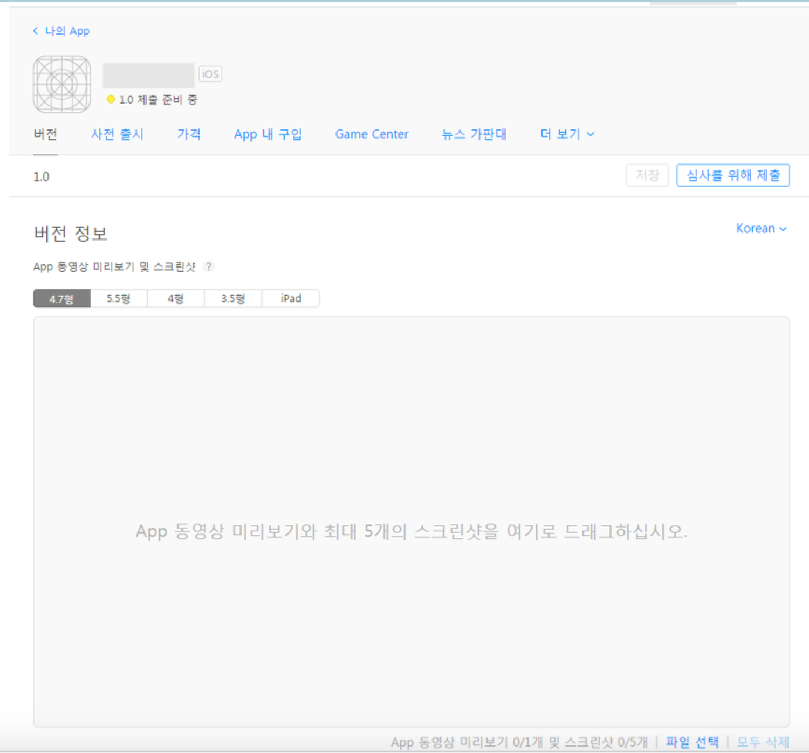
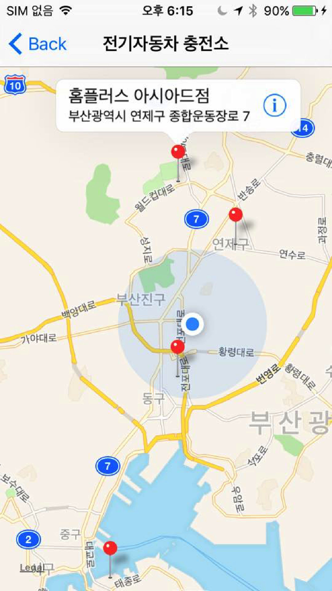
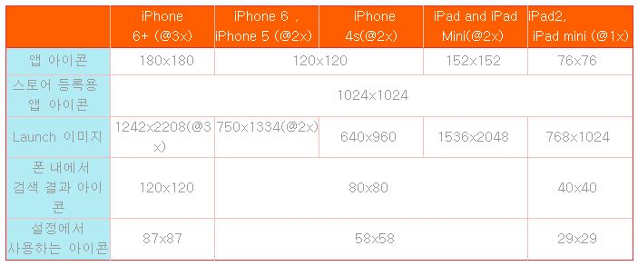
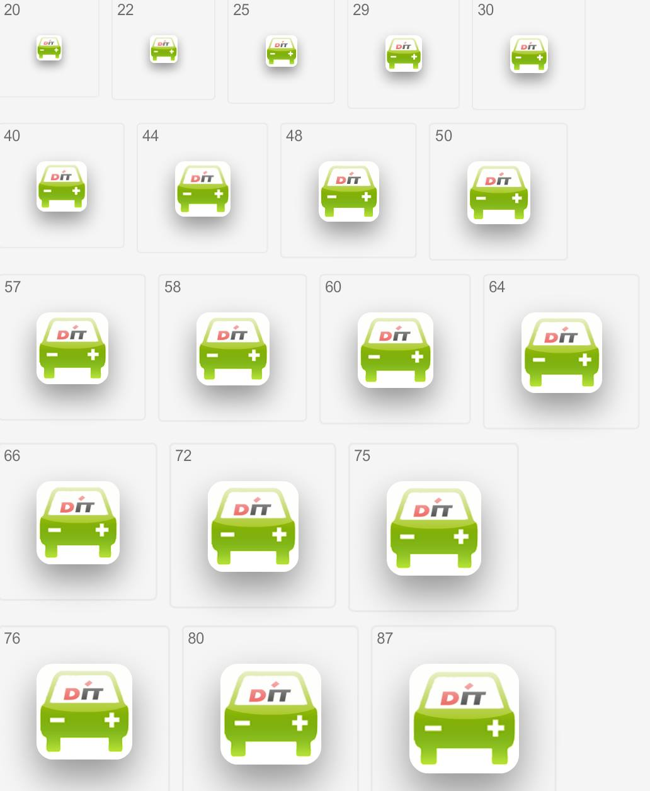
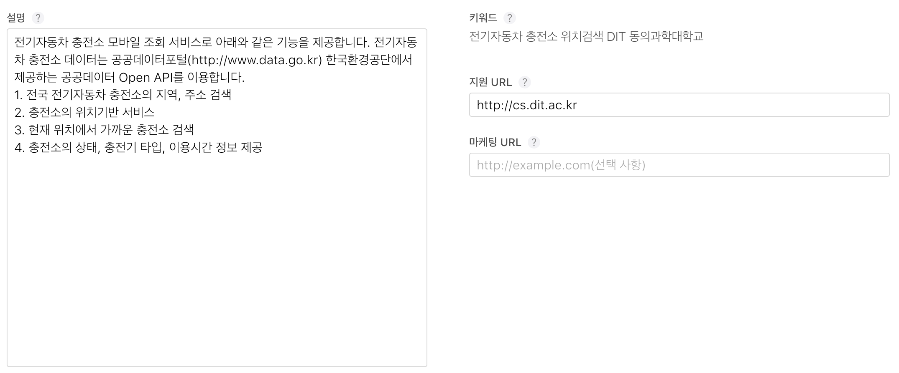

# 12 장 앱스토어 등록하기

아이폰 앱스토어는 아늗로이드 플레이 마켓과는 달리 애플의 리뷰어들이 애플 개발자 가이드라인에 의해 엄격하게 심사를 합니다. 애플의 앱스토어 심사 지침을 한번 읽어 보기 바랍니다.

https://developer.apple.com/app-store/review/guidelines/kr/

앱스토어 등록을 위해 필수적으로 준비해야 할 사항입니다.  

#### 앱 스크린샷

* 
아이폰 스크린 사이즈 별로 앱 스크린샷 최대 5개까지 준비
- 최근에 하나의 디바이스(예 5.5인치: 아이폰6+)를 올리면 스크린샷을 업로드 해주는 미디어 메니져가 나머지 회상도로 변환하도록 함
- 스크린샷은 RGB 색상 영역에 있는 JPG 혹은 PNG 형식이어야 함
- 크기(반드시 픽셀 크기로)
4.7형
5.5형(아이폰 6+) : 1242 x 2208 pixel 
4  형
3.5형

####앱 아이콘
* 
앱아이콘은 여러가지 크기가 필요하며, XCode 내의 Assets.xcassets에 등록한다.(아래 크기 표 참조).

* 중요: 하나더 있음 
앱스토어 앱정보 부분에 넣어야 하는 제일 큰 아이콘 사이즈는 **1024x1024 pixel** 임(아래 그림).

* 
먼저 앱스토어에 등록해야 하는  **제일 큰 사이즈의 이미지(1024 x 1024)**를 하나 준비하고, 나머지 사이즈(XCode)는 도구를 사용하여 만드는 것이 편리하다. 하나라도 요구하는 크기대로 하지 않으면 오류가 발생함.

* 최저 해상도가 720 DPI 이고, GRB 색상 영역에 있는 JPG 혹은 PNG 형식이어야 함. 레이어나 둥근 모서리가 있어서는 안됨

* 앱아이콘 자동 크기 조절 도구(icon slayer) 사이트 참고
[http://www.gieson.com/Library/projects/utilities/icon_slayer/](http://www.gieson.com/Library/projects/utilities/icon_slayer/)

####앱 설명

