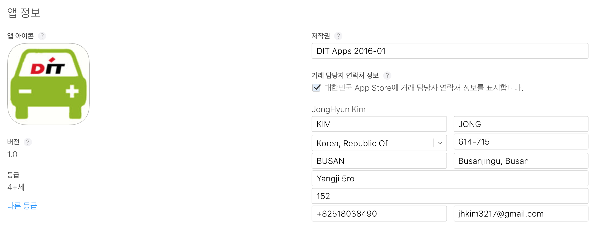

# 12 장 앱스토어 등록하기

#### 앱스토어 등록에 준비해야 할 것

1. 아이폰 스크린 사이즈 별로 앱 스크린샷 최대 5개까지 준비
- 최근에 하나의 디바이스(예 5.5인치: 아이폰6+)를 올리면 스크린샷을 업로드 해주는 미디어 메니져가 나머지 회상도로 변환하도록 함
- 스크린샷은 RGB 색상 영역에 있는 JPG 혹은 PNG 형식이어야 함

- 크기(반드시 픽셀 크기로)
4.7형
5.5형(아이폰 6+) : 1242 x 2208 pixel 
4  형
3.5형

![![![](5_5_ScreenShot.jpg

2. 앱아이콘

3. 앱 설명

