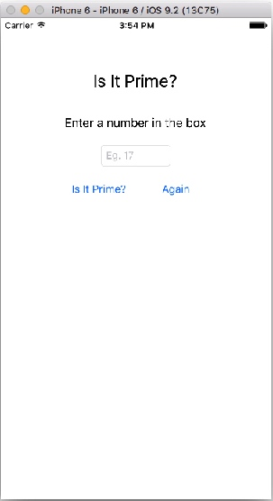

# 코딩 문제


**[코딩 문제 01] Button Fun 제작**

`UIButton`에 있는 현재의 text(Left Button, Right Button)을 받아와서 `UILabel`에 출력하시오.
 
 

**[코딩 문제 02] 버튼을 터치하여 Image 바꾸기**

toggle switch를 사용하여 버튼을 계속 터치하면 연속적으로 두개의 이미지가 바뀌도록 제작하시오.


**[코딩 문제 03] AutoLayout 사용하기 01**

[코딩 문제 01], [코딩 문제 02]의 UI를 AutoLayout를 적용하여 iPhone 4-inch(iPhone 4), 4.7-inch(iPhone 5,6), 5.5-inch(iPhone 6 plus)의 회상도에 적응적으로 보여질 수 있도록 제작하시오.


**[코딩 문제 04] AutoLayout 사용하기 02**

다음 UI와 같이 AutoLayout을 사용하여 portrait와 landscape 화면이 모두 적응적으로 보여질 수 있도록 제작하시오.


**[코딩 문제 05] 소수(Prime Number) 구하기 UI Autolayout 적용하기** 

아래 UI와 같이 디바이스의 portrait와 landscpae 화면을 4, 4.7, 5-inch에 적응적으로 출력하도록 UI를 제작하시오.


**[코딩 문제 06] 소수(Prime Number) 구하기 앱 제작**

아래의 Playgroung 알고리즘을 이용하여 소수(Prime Number)를 구하는 앱을 제작하시오.
* *코딩 조건 1)*
Again Button을 터치하면 TextField와 Result Label의 값이 초기화(clear) 되고, 키패드가 사라진다.
* *코딩 조건 2)*
TextField를 `ClearButtonMode`를 `Always`로 설정하시오.
* *코딩 조건 3)*
바탕화면(background view)를 터치하면 키패드가 사라진다.
* *코딩 조건 4)*
TextField에 입력을 하지 않고 입력처리 버튼(Is it Prime?)을 터치하면 결과를 계산하지 않고 "숫자를 입력하시오" 혹은 "Please enter a number"를 Result Label에 출력하도록 하시오.
* *코딩 조건 5)* 키패드를 default로 설정하고, [Return] 키를 터치하면 키패드가 사라지도록 하시오(`UITextFieldDelegate`를 사용하여 해당 함수를 overriding 하기 바람)


```Swift
// 소수의 정의 : 1을 제외하고 어떤 자연수로도 나누어질 수 없는 수를 소수라 함
// 10은 1, 2, 5, 10으로 나눌때 모두 나머지가 0이 되므로 소수가 아님

var number = 98
var isPrime = true

if number == 1 {   
    isPrime = false
}

if number != 2 && number != 1 {
   for var i = 2; i < number; i++ {
        if number % i == 0 {
            isPrime = false
        }
    }
}

print(isPrime)  // false 출력
```
* 결과 화면




