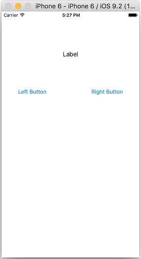

# 코딩 문제

**[코딩 문제 01] Button Fun 제작**

`UIButton`에 있는 현재의 text(Left Button, Right Button)을 받아와서 `UILabel`에 출력하시오.
 
 

**[코딩 문제 02] 버튼을 터치하여 Image 바꾸기**

toggle switch를 사용하여 버튼을 계속 터치하면 연속적으로 두개의 이미지가 바뀌도록 제작하시오.

