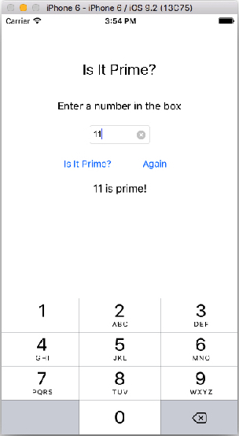
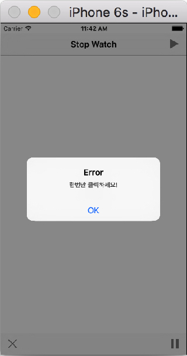
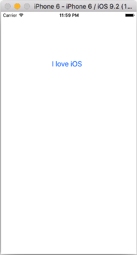
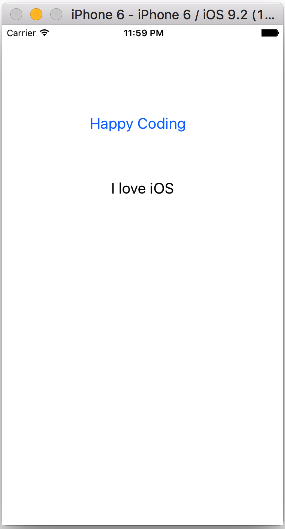
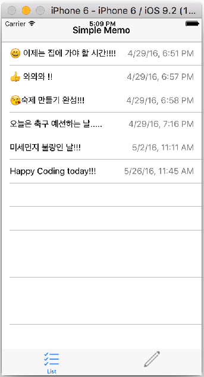
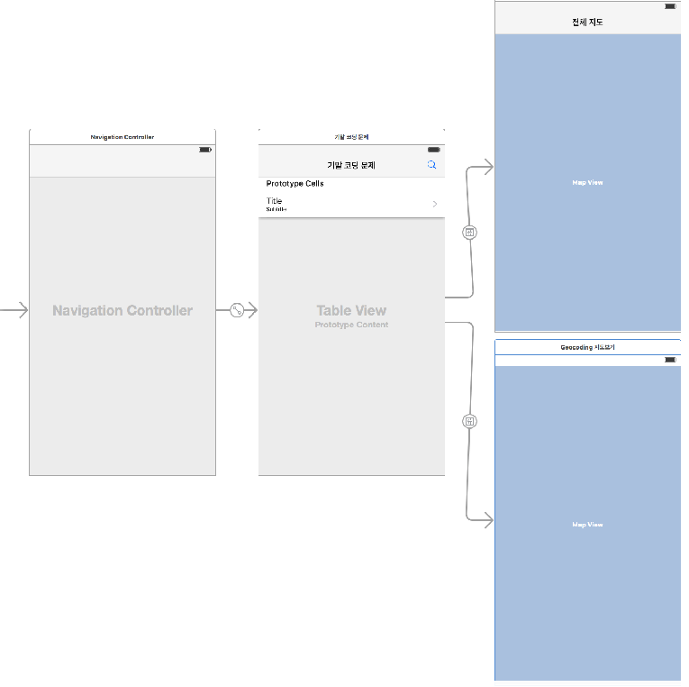
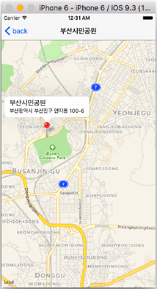

# 코딩 문제


**[코딩 문제 01] Button Fun 제작**

`UIButton`에 있는 현재의 text(Left Button, Right Button)을 받아와서 `UILabel`에 출력하시오.
 
 

**[코딩 문제 02] 버튼을 터치하여 Image 바꾸기**

toggle switch를 사용하여 버튼을 계속 터치하면 연속적으로 두개의 이미지가 바뀌도록 제작하시오.


**[코딩 문제 03] AutoLayout 사용하기 01**

[코딩 문제 01], [코딩 문제 02]의 UI를 AutoLayout를 적용하여 iPhone 4-inch(iPhone 4), 4.7-inch(iPhone 5,6), 5.5-inch(iPhone 6 plus)의 회상도에 적응적으로 보여질 수 있도록 제작하시오.


**[코딩 문제 04] AutoLayout 사용하기 02**

다음 UI와 같이 AutoLayout을 사용하여 portrait와 landscape 화면이 모두 적응적으로 보여질 수 있도록 제작하시오.


**[코딩 문제 05] 소수(Prime Number) 구하기 UI Autolayout 적용하기** 

아래 UI와 같이 디바이스의 portrait와 landscpae 화면을 4, 4.7, 5-inch에 적응적으로 출력하도록 UI를 제작하시오.


**[코딩 문제 06] 소수(Prime Number) 구하기 앱 제작**

아래의 Playgroung 알고리즘을 이용하여 소수(Prime Number)를 구하는 앱을 제작하시오.
* *코딩 조건 1)*
Again Button을 터치하면 TextField와 Result Label의 값이 초기화(clear) 되고, 키패드가 사라진다.
* *코딩 조건 2)*
TextField를 `ClearButtonMode`를 `Always`로 설정하시오.
* *코딩 조건 3)*
바탕화면(background view)를 터치하면 키패드가 사라진다.
* *코딩 조건 4)*
TextField에 입력을 하지 않고 입력처리 버튼(Is it Prime?)을 터치하면 결과를 계산하지 않고 "숫자를 입력하시오" 혹은 "Please enter a number"를 Result Label에 출력하도록 하시오.
* *코딩 조건 5)* 키패드를 default로 설정하고, [Return] 키를 터치하면 키패드가 사라지도록 하시오(`UITextFieldDelegate`를 사용하여 해당 함수를 overriding 하기 바람)


```Swift
// 소수의 정의 : 1을 제외하고 어떤 자연수로도 나누어질 수 없는 수를 소수라 함
// 10은 1, 2, 5, 10으로 나눌때 모두 나머지가 0이 되므로 소수가 아님

var number = 98
var isPrime = true

if number == 1 {   
    isPrime = false
}

if number != 2 && number != 1 {
   for var i = 2; i < number; i++ {
        if number % i == 0 {
            isPrime = false
        }
    }
}

print(isPrime)  // false 출력
```
* 결과 화면





**[코딩 문제 07] `UIImageView`를 이용한 슬라이드 쇼 앱 제작**

* *코딩 조건 1)*
image를 5개를 배열에 넣고, 디바이스가 landscape 형식으로 보여 지게 하라.
* *코딩 조건 2)*
Forward/Backwrad 버튼을 한번 터치할때 마다 이미지가 한장씩 순방향/역방향으로 각각 이동하며, 마지막 이미지와 첫번째 이미지를 만나면 circular 방식(1->2->3->4->5->4->3->2->1)으로 보여진다.
* *코딩 조건 3)*
이미지의 첫번째와 마지막에서 더이상의 이미지를 보여줄 수 없을때는 각각 Forward/ Backward 버튼은 각각 hidden 된다. 

*1) 첫번째 이미지*


*2) 두번째 이미지*


*3) 세번째 이미지*


**[코딩 문제 08] [코딩 문제 07]을 `NSTimer`를 이용하여 슬라리드 쇼가 될 수 있도록 Play/Stop 버튼(AutoSlider)을 추가하시오.**


**[코딩 문제 09] [코딩 문제 08]을 AutoLayou을 적용하여 아이폰 4-inch", 4.7-inch, 5.5-inch가 모두 정상적을 보여질 수 있도록 하시오.**


**[코딩 문제 10] 아래 실행 결과를 참고하여 UIAlertController을 사용하여 윗 버튼(Show Action Sheet)을 터치하면 ActionSheet가, 아래 버튼(Show Alert)을 터치하면 AlertView가 출력하도록 제작하시오.**

 


**[코딩 문제 11] Stop Watch 업그레이드 하기**
* 
**현재 제작한 Stop Watch는 play를 하고 있는 상태에서 다시 play를 하면 Timer가 중복으로 작동하여 시계를 두배 빠르게 작동하게 한다. 이러한 문제점을 해결하시오(play 상태에서는 play를 하지 못하도록 하고 Alert로 알려 주기 바람)**
* 
**AutoLayout을 사용하여 모든 디바이스 크기 및 회전에도 대응하도록 하시오.**





**[Mid Exam 01]**

* 
버튼 3개를 각각 터치하면 각각 `UIView`의 background 색깔이 변경된다.


* 
Autolayout을 아래와 같이 적용하라.


**[Mid Exam 02]**
* 
버튼("010-123-1234")를 터치하면 Alert 창이 나타난다.
* Alert 창의 message는 버튼의 current title("010-123-1234")을 받아서 출력한다.
* Alert 창의 [OK] 버튼을 터치하면 아래와 같이 Action Sheet가 출력되도록 하라. 이때 전화번호 String도 위로 같이 current 버튼의 title로 부터 받아서 출력한다.

 


**[코딩 문제 12]  Segue를 이용하여 ViewController 간의 데이터 넘겨 주기**

* Button을 터치하면 두개의 ViewController 간 Button(I love iOS, Happy Coding)에 있는 title 스트링 값을 전달하여 Lable(I love iOS, Happy Coding)에 출력한다.

`FirstViewController`               



`SecondViewController`



`FirstViewController`

 

   
**[코딩 문제 13] 메모장 기능 추가하기 mini 프로젝트** 

제6장 메모장(To-Do-List) 앱 소스를 이용하여 창의적이고 실용적인 다양한 기능을 추가하시오.

예1)`NSDate`를 이용한 날짜 추가하기 기능
#####참고 : `NSDateForamtter, NSDate`
https://iosdevcenters.blogspot.com/2016/03/nsdateformatter-in-swift.html



예2) 메모장에 이모티콘 선택하여 추가하기 기능


예3) 기타 등등 메모장 앱을 편리하게 하는 다양한 기능 추가


##기말 코딩 시험## 
####2016.6.21(화)####
아래의 storyboard를 참고하여 코딩하세요.


####(문제 1) 
* 
plist 화일을 작성하고, 데이터를 load하여 아래의 테이블뷰를 만든다.
* 
`plist key/ value : address/ title`

부산광역시 부산진구 양지로 54/ 동의과학대학교

부산광역시 부산진구 영지동 100-6/ 부산시민공원

부산광역시 부사진구 부전동 부전로 503-15


 


#### (문제 2) 


* 
테이블뷰의 각 cell을 선택하면 아래와 같이 detailViewController에 지도를 표시한다. 
* 
이때 각 cell의 주소를 goecoding하고, pin의 title과 subtitle을 아래와 같이 설정한다.
* 
NavigationBar의 title 내용도 아래와 같이 설정한다.
지도의 center는 latitude: 35.164472, longitude: 129.064898로 설정하라.

   

####(문제 3) 
* 
NavigationBar의 오른쪽에 UIBarButtonItem을 이용하여 아래와 같이 System Icon(Serach)를 설정한다.
* 
BarButtonItem Icon을 선택하면, 아래와 같이 detailViewController에 테이블뷰에 있는 모든 주소(3곳)의 지도를 아래와 같이 표시하라. 
* 
plist 데이터를 load하여 주소를 geocoding 하여 지도와 pin을 아래와 같이 설정한다.
  


