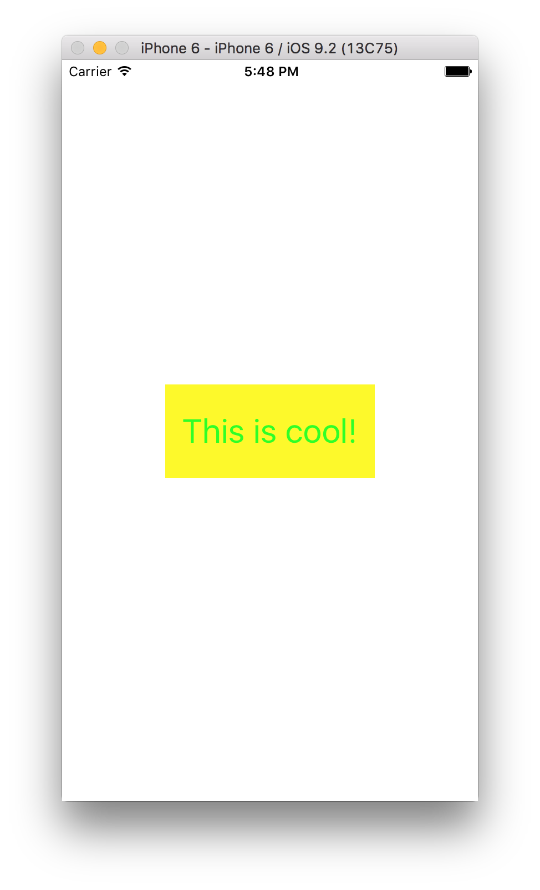
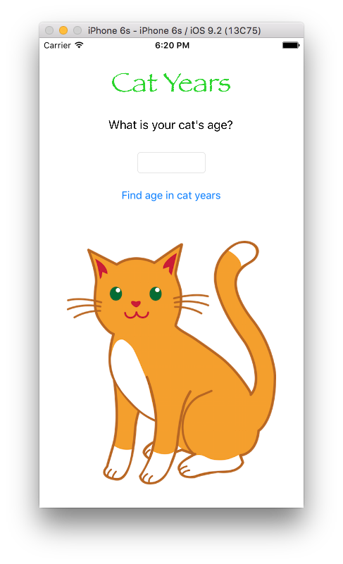
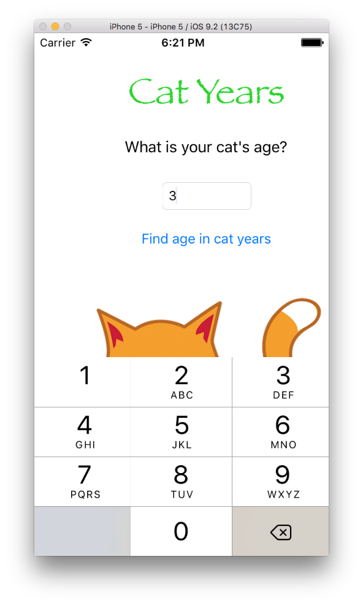

# 01 장

1. 앱에 Label 추가하기

2. 

3. 

4. Cat Year

import UIKit

class ViewController: UIViewController {

    @IBOutlet var catAgeTextField: UITextField!
    
    @IBOutlet var resultLabel: UILabel!
    
    @IBAction func findAge(sender: AnyObject) {
        
        var catAge = Int(catAgeTextField.text!)!
        
        catAge = catAge * 7
        
        resultLabel.text = "Your cat is \(catAge) in cat years"
        
        
    }
    
    override func viewDidLoad() {
        super.viewDidLoad()
        // Do any additional setup after loading the view, typically from a nib.
    }

    override func didReceiveMemoryWarning() {
        super.didReceiveMemoryWarning()
        // Dispose of any resources that can be recreated.
    }

}
 

