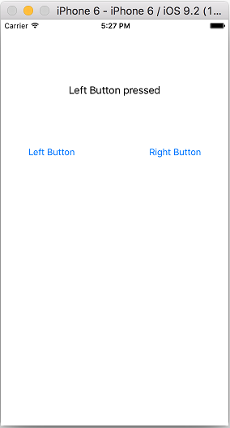
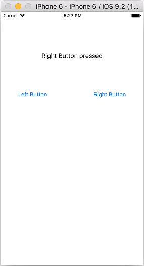
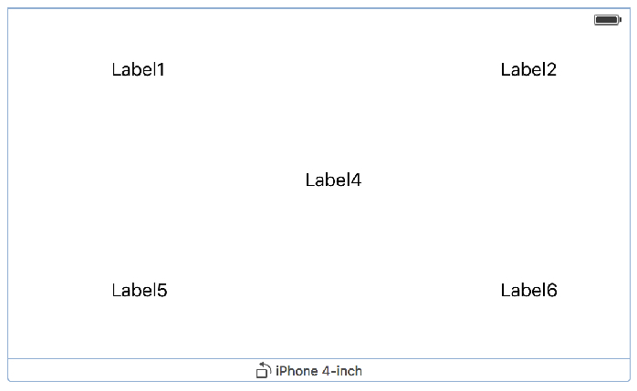

# 01 장

####1 앱에 Label 추가하기


 
#### 2 How old are you? 

* **`IBOutlet`변수**는 IB(Interface Builder)와 소스 코드(UIViewController.swift)와의 연결을 위한 변수임
* **`IBAction`메소드**는 IB(Interface Builder)의 이벤트 처리 객체를 소스 코드(UIViewController.swift)에서 이벤트 핸들링을 위한 함수임 


[이미지 다운로드](https://dl.dropboxusercontent.com/u/11130733/Lec_2016_public/people.gif)
```swift
//  ViewController.swift
import UIKit

class ViewController: UIViewController, UITextFieldDelegate {

    @IBOutlet var resultLabel: UILabel!
    @IBOutlet var myTextField: UITextField!
    
    @IBAction func againButtonPressed(sender: AnyObject) {  
        resultLabel.text = ""
        myTextField.text = ""
    }
    @IBAction func buttonPressed(sender: AnyObject) {
        
        // 강제 풀기(Forced Unwrapping)
        /*
        let myAge = myTextField.text!  // UIView.text? 는 optional type 임
        //let myAge = nil
        print("나는 꽃다운" + myAge + "세 예요!")
        */
        
        // Optional Binding
        if let myAge = myTextField.text  {
            //print("나는 꽃다운" + myAge + "세 예요!")
            let resultStr = "나는 꽃다운 " + myAge + " 세 예요!"
            resultLabel.text = resultStr
        }        
    }
    
    // 바탕(UIView)에 터치를 하면 키패드를 끝낸다.
    override func touchesBegan(touches: Set<UITouch>, withEvent event: UIEvent?) {
        view.endEditing(true)
        view.backgroundColor = UIColor.blueColor()
    }
    
    override func viewDidLoad() {
        super.viewDidLoad()
        
        // textField의 delete key 보이게 설정
        myTextField.clearButtonMode = UITextFieldViewMode.Always
    }
    
    // called when clear button pressed. return NO to ignore (no notifications)
    func textFieldShouldClear(textField: UITextField) -> Bool  {
        return true
    }
}

```

####3 ```UITextFieldDelegate``` 

**Managing Editing**
```Swift
- textFieldShouldBeginEditing:
- textFieldDidBeginEditing:
- textFieldShouldEndEditing:
- textFieldDidEndEditing:
```

**Editing the Text Field’s Text**
```Swift
- textField:shouldChangeCharactersInRange:replacementString:
- textFieldShouldClear:
- textFieldShouldReturn:
```

```Swift
// UITextFieldDelegate Fuction Test
// MARK: UITextFieldDelegate Function
    // called when 'return' key pressed. return NO to ignore.
    func textFieldShouldReturn(textField: UITextField) -> Bool {
        myTextField.resignFirstResponder()
        return true
    }
    
    func textFieldShouldClear(textField: UITextField) -> Bool {
        print("textFieldShouldClear started")
        return false
    }
    
    // return NO to disallow editing.
    func textFieldShouldBeginEditing(textField: UITextField) -> Bool  {
        print("textFieldShouldBeginEditing started")
        return true
    }
    
    // became first responder
    func textFieldDidBeginEditing(textField: UITextField) {
        print("textFieldDidBeginEditing started")
    }
    
    func textFieldDidEndEditing(textField: UITextField) {
        print("textFieldDidEndEditing started")
    }
```

```Swift
// MARK: UITextFieldDelegate Fuction
// RETURN key를 터치하면 키패드가 사라짐  
func textFieldShouldReturn(textField: UITextField) -> Bool {
     catAgeTextField.resignFirstResponder() 
     return true        
}

//  UITextField의 delete key를 터치하면 입력한 모든 문자를 지움    
func textFieldShouldClear(textField: UITextField) -> Bool { 
     return true   
}
```


  
  [이미지 다운로드](https://dl.dropboxusercontent.com/u/11130733/Lec_2016_public/cat.png)
  
```swift
    // ViewController.swift
    import UIKit
    
    class ViewController: UIViewController, UITextFieldDelegate {
        @IBOutlet var catAgeTextField: UITextField!
        @IBOutlet var resultLabel: UILabel!
        
        @IBAction func findAge(sender: AnyObject) { 
            var catAge = Int(catAgeTextField.text!)!
            catAge = catAge * 7
            resultLabel.text = "Your cat is \(catAge) in cat years"
        }
        
        override func viewDidLoad() {
            super.viewDidLoad()
            // Do any additional setup after loading the view, typically from a nib.
            catAgeTextField.delegate = self
            catAgeTextField.clearButtonMode = UITextFieldViewMode.Always
        }
    
        override func touchesBegan(touches: Set<UITouch>, withEvent event: UIEvent?) {
            self.view.endEditing(true)
        }
        // default 키패드의 경우 [Return] 키를 터치하면 실행
        func textFieldShouldReturn(textField: UITextField) -> Bool {
            catAgeTextField.resignFirstResponder()
            return true
        }
        
        func textFieldShouldClear(textField: UITextField) -> Bool {
            return true
        }
    }
```

---


**[코딩 문제 01] Button Fun 제작**

`UIButton`에 있는 현재의 text(Left Button, Right Button)을 받아와서 `UILabel`에 출력하시오.
 
 

**[코딩 문제 02] 버튼을 터치하여 Image 바꾸기**

toggle switch를 사용하여 버튼을 계속 터치하면 연속적으로 두개의 이미지가 바뀌도록 제작하시오.


**[코딩 문제 03] AutoLayout 사용하기 01**

[코딩 문제 01], [코딩 문제 02]의 UI를 AutoLayout를 적용하여 iPhone 4-inch(iPhone 4), 4.7-inch(iPhone 5,6), 5.5-inch(iPhone 6 plus)의 회상도에 적응적으로 보여질 수 있도록 제작하시오.

**[코딩 문제 04] AutoLayout 사용하기 02**

다음 UI와 같이 AutoLayout을 사용하여 portrait와 landscape 화면이 모두 적응적으로 보여질 수 있도록 제작하시오.





**[코딩 문제 06] 소수(Prime Number) 구하기 앱 제작**

아래의 Playgroung 알고리즘을 이용하여 소수(Prime Number)를 구하는 앱을 제작하시오.
* *코딩 조건 1)*
Again Button을 터치하면 TextField와 Result Label의 값이 초기화(clear) 되고, 키패드가 사라진다.
* *코딩 조건 2)*
TextField를 `ClearButtonMode`를 `Always`로 설정하시오.
* *코딩 조건 3)*
바탕화면(background view)를 터치하면 키패드가 사라진다.
* *코딩 조건 4)*
TextField에 입력을 하지 않고 입력처리 버튼(Is it Prime?)을 터치하면 결과를 계산하지 않고 "숫자를 입력하시오" 혹은 "Please enter a number"를 Result Label에 출력하도록 하시오.
* *코딩 조건 5)* 키패드를 default로 설정하고, [Return] 키를 터치하면 키패드가 사라지도록 하시오(`UITextFieldDelegate`를 사용하여 해당 함수를 overriding 하기 바람)


```Swift
// 소수의 정의 : 1을 제외하고 어떤 자연수로도 나누어질 수 없는 수를 소수라 함
// 10은 1, 2, 5, 10으로 나눌때 모두 나머지가 0이 되므로 소수가 아님

var number = 98
var isPrime = true

if number == 1 {   
    isPrime = false
}

if number != 2 && number != 1 {
   for var i = 2; i < number; i++ {
        if number % i == 0 {
            isPrime = false
        }
    }
}

print(isPrime)  // false 출력
```
* 결과 화면


