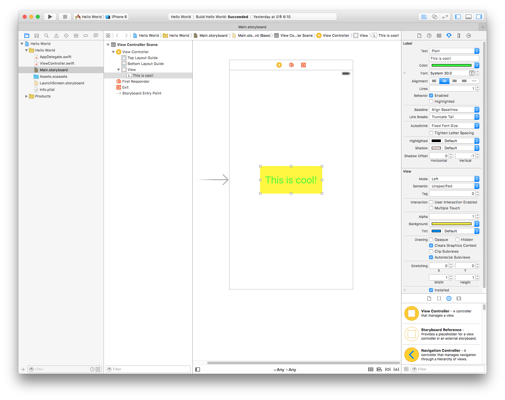
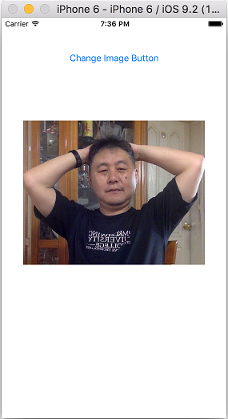
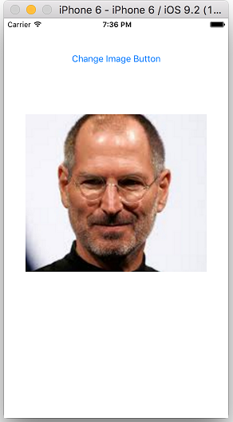

# 01 장

####1 앱에 Label 추가하기



 
#### 2 How old are you? 

* **`IBOutlet`변수**는 IB(Interface Builder)와 소스 코드(UIViewController.swift)와의 연결을 위한 변수임
* **`IBAction`메소드**는 IB(Interface Builder)의 이벤트 처리 객체를 소스 코드(UIViewController.swift)에서 이벤트 핸들링을 위한 함수임 


[이미지 다운로드](https://dl.dropboxusercontent.com/u/11130733/Lec_2016_public/people.gif)
```swift
    // ViewController.swift
    import UIKit
    
    class ViewController: UIViewController {
        @IBOutlet var label: UILabel!
        @IBOutlet var textField: UITextField!
        
        @IBAction func submit(sender: AnyObject) {
            print("Button tapped")
            label.text = textField.text
        }
        
        override func viewDidLoad() {
            super.viewDidLoad()
            print("Hello Kim!")
        }
    
        override func didReceiveMemoryWarning() {
            super.didReceiveMemoryWarning()
            // Dispose of any resources that can be recreated.
        }
    }
```

####3 ```UITextFieldDelegate``` 


```Swift
// MARK: UITextFieldDelegate Fuction
func textFieldShouldReturn(textField: UITextField) -> Bool {
     catAgeTextField.resignFirstResponder() 
     return true
        
}
    
func textFieldShouldClear(textField: UITextField) -> Bool { 
     return true   
}
```


  
  [이미지 다운로드](https://dl.dropboxusercontent.com/u/11130733/Lec_2016_public/cat.png)
  
```swift
    // ViewController.swift
    import UIKit
    
    class ViewController: UIViewController, UITextFieldDelegate {
        @IBOutlet var catAgeTextField: UITextField!
        @IBOutlet var resultLabel: UILabel!
        
        @IBAction func findAge(sender: AnyObject) { 
            var catAge = Int(catAgeTextField.text!)!
            catAge = catAge * 7
            resultLabel.text = "Your cat is \(catAge) in cat years"
        }
        
        override func viewDidLoad() {
            super.viewDidLoad()
            // Do any additional setup after loading the view, typically from a nib.
            catAgeTextField.delegate = self
            catAgeTextField.clearButtonMode = UITextFieldViewMode.Always
        }
    
        override func touchesBegan(touches: Set<UITouch>, withEvent event: UIEvent?) {
            self.view.endEditing(true)
        }
        
        func textFieldShouldReturn(textField: UITextField) -> Bool {
            catAgeTextField.resignFirstResponder()
            return true
        }
        
        func textFieldShouldClear(textField: UITextField) -> Bool {
            return true
        }
    }
```

---


**[코딩 문제 01] Button Fun 제작**

`UIButton`에 있는 현재의 text(Left Button, Right Button)을 받아와서 `UILabel`에 출력하시오.
 
 

**[코딩 문제 02] 버튼을 터치하여 Image 바꾸기**

toggle switch를 사용하여 버튼을 계속 터치하면 연속적으로 두개의 이미지가 바뀌도록 제작하시오.



**[코딩 문제 03] 문제 01, 문제 02 프로그램의 UI를 AutoLayout를 적용하여 iPhone 4-inch(iPhone 4), 4.7-inch(iPhone 5,6), 5.5-inch(iPhone 6 plus)의 회상도에 적응적으로 보여질 수 있도록 제작하시오.

